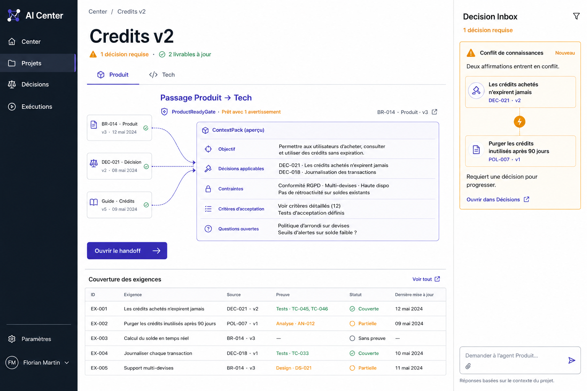
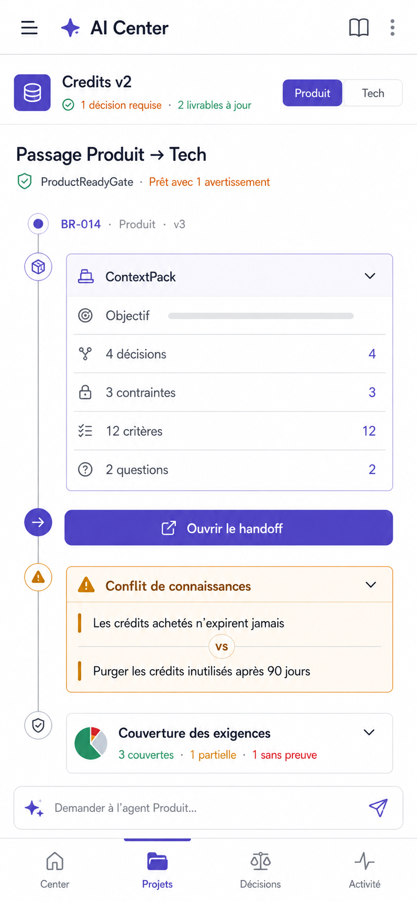

# AI Center

AI Center est un plan de contrôle contextuel pour projets agentiques. Il structure les décisions, prépare le contexte destiné aux agents, orchestre les passages de relais et vérifie que les livrables restent cohérents avec l’intention du projet.

> **From intent to evidence, without context drift.**

## État du projet

Le MVP Linux/web est implémenté et le même client est désormais construit pour
Android avec Tauri v2. Le premier parcours couvre :

```text
Intention Produit
→ connaissances structurées
→ Feature Brief
→ ContextPack Tech
→ handoff
→ Technical Delivery Plan
→ preuves et couverture
→ contrôle de cohérence
```

Le même frontend responsive fonctionne dans le navigateur et dans une enveloppe
Tauri v2. Un serveur Rust/Axum porte le domaine et le moteur agentique ; Supabase
PostgreSQL conserve le graphe, les versions, les livrables, les preuves et
l’audit.

## Documentation

| Dossier                                        | Rôle                                              |
| ---------------------------------------------- | ------------------------------------------------- |
| [`docs/product`](docs/product)                 | Documentation produit consolidée et maintenue     |
| [`docs/source-material`](docs/source-material) | Sources originales ayant alimenté le cadrage      |
| [`docs/ux`](docs/ux)                           | Concepts et futures spécifications d’expérience   |
| [`docs/decisions`](docs/decisions)             | Décisions durables de produit et d’architecture   |
| [`specs`](specs)                               | Spécifications exécutables ou orientées livraison |
| [`apps`](apps)                                 | Applications web, serveur Rust et desktop Tauri   |
| [`packages`](packages)                         | Futurs packages partagés                          |

Commencer par :

1. [`Vision produit`](docs/product/02-product-vision.md)
2. [`Stratégie de différenciation`](docs/product/05-product-differentiation.md)
3. [`Scope MVP`](docs/product/04-mvp-scope.md)
4. [`Personas et cas d’usage`](docs/product/03-personas-and-use-cases.md)
5. [`Validation du MVP`](specs/mvp-control-plane/validation.md)

## Concepts UX

### Desktop



### Mobile



## Développement local

Prérequis Linux : Node.js 24+, Rust 1.91+, Docker, GTK 3 et WebKitGTK 4.1.

```bash
npm install
npx supabase start
cp .env.example .env.local
npm run dev:server
npm run dev:web
```

Pour les tests déterministes, définir `AI_CENTER_AGENT_MODE=deterministic`. La
clé `OPENAI_API_KEY` n’est lue que par le serveur et ne doit jamais être
préfixée par `VITE_`.

Commandes utiles :

```bash
npm run lint
npm test
npm run build
npm run build:desktop
```

## Android

Le client Android réutilise l’intégralité du frontend React. Il reste un client
du serveur Rust : aucune clé OpenAI ni connexion PostgreSQL n’est embarquée dans
l’application.

Prérequis supplémentaires : JDK 17 ou 21, Android SDK/Build Tools, NDK et les
cibles Rust Android. Les scripts détectent les installations usuelles sous
`$HOME/Android` :

```bash
npm run android:init
npm run build:android:debug
npm run build:android
npm run verify:android
```

Les APK debug signés pour téléphone arm64 et émulateur x86_64 sont produits sous
`apps/desktop/src-tauri/gen/android/app/build/outputs/apk/`. Le bundle AAB et
l’APK release non signé sont sous les dossiers `bundle/` et `apk/universal/`.
La signature de publication Google Play reste volontairement hors MVP.

Dans l’émulateur Android, le client vise par défaut `http://10.0.2.2:4317`.
Une installation réelle doit être construite avec `VITE_API_URL` pointant vers
le serveur HTTPS déployé et cette origine doit être ajoutée explicitement à la
CSP Tauri. La procédure complète d’installation et de validation est décrite
dans [`docs/platforms/android.md`](docs/platforms/android.md).

L’API écoute par défaut sur `http://127.0.0.1:4317`, le client web sur
`http://127.0.0.1:5173` et PostgreSQL local sur le port `54322`. Les conventions
de travail agentique sont décrites dans [`AGENTS.md`](AGENTS.md) et le workflow
spec-driven dans [`specs/README.md`](specs/README.md).

## Licence

Aucune licence open source n’est encore accordée. Le dépôt peut être public sans que son contenu soit automatiquement réutilisable. Une licence sera choisie explicitement lorsque la stratégie de distribution sera arrêtée.
