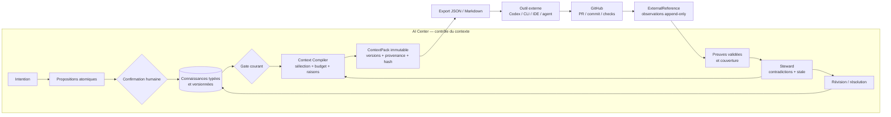
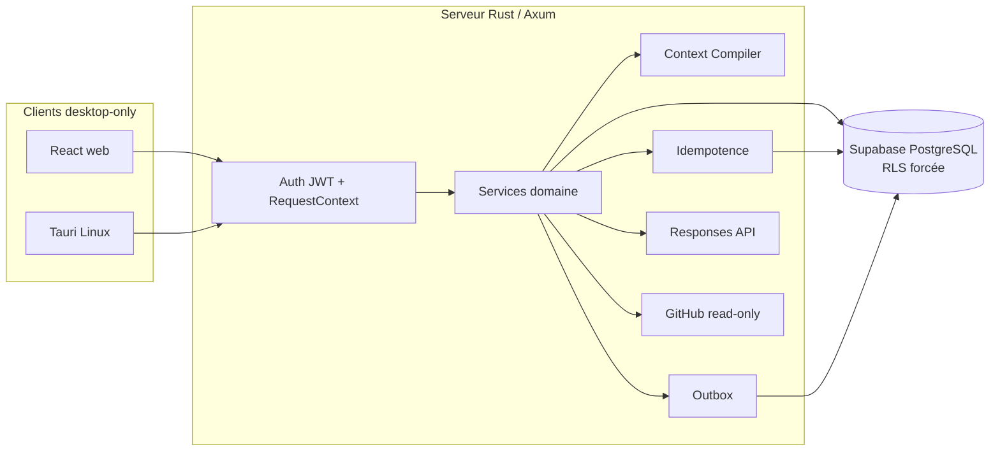

# AI Center

> **De l’intention à la preuve, sans dérive de contexte.**

AI Center est un plan de contrôle contextuel pour les projets menés avec
plusieurs équipes, agents IA et outils spécialisés. Il transforme les échanges
en connaissances confirmées et versionnées, compile le contexte utile à une
tâche, formalise les passages de relais et rend visibles la provenance, les
contradictions, l’obsolescence et la couverture des exigences.

AI Center n’est ni un IDE, ni un runner, ni un producteur de code. GitHub,
Linear, Notion, Figma, les bases de données, les CLI et les agents spécialisés
restent canoniques pour ce qu’ils produisent. AI Center conserve et transmet le
contexte partagé, puis rattache les résultats externes à des références et à des
preuves contrôlables.

## État réel au 5 septembre 2026

Le socle logiciel **Alpha Context Proof est consolidé** sur
`feat/alpha-context-proof`, [PR #1](https://github.com/gneed49/ai-center/pull/1),
avec suivi dans l'[issue #2](https://github.com/gneed49/ai-center/issues/2).
Le point de contrôle fonctionnel est `a9b3140`. Les constats Standards/Spec et
le dernier écart de calibration sont corrigés et revus. Les gates réels restent
ouverts ; aucune release ou alpha équipe n'est annoncée.

| Statut | Sens |
| --- | --- |
| `Vérifié` | Reproduit sur la version et dans l'environnement indiqués. |
| `Présent mais non reproduit` | Code ou artefact disponible, parcours complet non exécuté. |
| `Déclaré` | Résultat historique sans reproduction sur la version courante. |
| `Futur` | Résultat ou exploitation encore à réaliser. |

| Surface | Preuve locale reproduite |
| --- | --- |
| Backend | 89 tests Rust, tous les tests compilés et Clippy strict sur `7a1a64c`, intégré sans changement de source. |
| Évaluation | 27 tests offline et schémas valides sur `fc30ab6` ; métriques calculées depuis les entrées vérifiées et annotations humaines. |
| PostgreSQL | `7a1a64c` : base neuve et upgrade, 32 pgTAP, 11 tests métier avec rôle RLS runtime ; appels longs et concurrence couverts. |
| Sauvegarde et auth | `84634b7` : 39 tables et 96 policies restaurées/comparées ; magic link local et réponses attendues 200/200/403/403/401 ; nettoyage confirmé. |
| Web | Six Vitest, lint et build sur `c8a723b` ; source web inchangée par les corrections de revue. |
| Desktop simulé | 126/126 sur `90ca758` : 42 scénarios × Chromium 1440×900, Chromium 1024×768 et Firefox 1440×900 ; aucun retry. |
| Tauri Linux | `90ca758` : build avec overlay isolé et empreinte ; quatre tests de garde. Le parcours métier natif n'a pas été exécuté. |
| Navigateur sur API/DB réelles | Preuve antérieure `37921d8`, 1/1 jusqu'au handoff rechargé ; extension récente vers plan/couverture/historique non reproduite localement. |
| Dépendances | Installation propre et audit npm sans avis ; audit Rust sans avis bloquant, avec avertissements et exception documentés. |

Le [rapport de revue et validation](specs/alpha-context-proof/review-2026-09-05.md)
conserve versions, commandes et limites. L'[audit courant](docs/current-state-audit.md)
sépare ces preuves des gates du plan. Les résultats CI du HEAD se consultent
directement sur la PR ; les anciens runs d'août ne certifient pas cette reprise.

Restent `Présent mais non reproduit` : exploration UI de cette reprise et smoke
métier natif. L'environnement a bloqué l'exécution interactive ; aucun autre
canal n'a été utilisé pour la contourner.

Restent `Futur` : campagne comparative sur trois projets autorisés dans le budget
de 100 USD, GitHub App privée, dix boucles propriétaires sur une semaine, puis
alpha HTTPS de deux à trois utilisateurs pendant deux semaines. Le quota OpenAI
signalé en août n'a pas été recontrôlé. Aucun build, test ou viewport mobile
n'appartient à ce jalon.

La migration des observations et le serveur doivent être mis à niveau ensemble ;
voir les [consignes de migration](specs/alpha-context-proof/review-2026-09-05.md#migration-et-exploitation).

## Proposition de valeur

AI Center doit démontrer qu’un projet agentique devient plus fiable lorsque :

1. l’intention devient une connaissance atomique confirmée, versionnée et
   sourcée, plutôt qu’un simple transcript ;
2. chaque tâche reçoit un `ContextPack` sélectif, explicable et immutable ;
3. le contexte est transmis à l’outil externe sans reconstruire manuellement le
   raisonnement ;
4. le résultat externe est rattaché à une référence durable et observée ;
5. une preuve validée met à jour la couverture des exigences ;
6. les contradictions et les dépendances obsolètes sont visibles et peuvent
   entraîner une vraie révision du contexte.

La doctrine est **intégrer avant de remplacer** et **référencer avant de
dupliquer**.

## Flow cible de bout en bout



Les sources Mermaid détaillées sont versionnées dans
[`docs/architecture`](docs/architecture/README.md) :

- [flow contextuel de bout en bout](docs/architecture/context-control-flow.md) ;
- [cycle de vie d’un ContextPack](docs/architecture/context-pack-lifecycle.md) ;
- [séquence export → outil → GitHub → preuve](docs/architecture/external-proof-sequence.md).

Le [flowchart FigJam éditable](https://www.figma.com/board/gn5z1F1tnQpQ23580fQ5QC?utm_source=other&utm_content=edit_in_figjam&oai_id=v1%2Fw4Op3Y3yGzQaNiGag9bVe9tyqgyd72pnQ7P1yHakH4IGC28Jc0zH6q&request_id=30a987bf-c867-40eb-9df4-fdb761c7b90d)
reste un support visuel complémentaire ; Mermaid est la source versionnée. Les
exports prêts à partager sont disponibles en
[SVG](docs/architecture/assets/alpha-context-control-flow.svg) et
[PNG](docs/architecture/assets/alpha-context-control-flow.png).

## Capacités du snapshot

| Domaine                 | État de preuve                          | Réalité actuelle                                                                      |
| ----------------------- | --------------------------------------- | ------------------------------------------------------------------------------------- |
| Projets et sessions     | `Vérifié` sur DB/API et navigateur réel | routes project-scoped, rôle RLS, persistance et propositions structurées              |
| Validation humaine      | `Vérifié` sur PostgreSQL                | confirmation/rejet, versions, provenance et non-invention de source                   |
| Gate et Feature Brief   | `Vérifié` sur PostgreSQL                | gate lié à la graph version et livrable sourcé                                        |
| ContextPack             | `Vérifié` en unité, DB et navigateur    | sélection, exclusions, budget, raisons, versions, stale et digest                     |
| Handoff et session Tech | `Vérifié` full-stack                    | pack explicite, blocage stale/hors projet et restauration après reload                |
| Plan technique          | `Vérifié` avec double déterministe      | sortie structurée fondée uniquement sur le pack ; qualité OpenAI réelle non certifiée |
| Couverture et preuves   | `Vérifié` en DB/UI mockée               | couverture persistante et états de preuve ; GitHub live absent                        |
| Steward et résolution   | `Vérifié` sur PostgreSQL                | contradictions multiples, résolution atomique, stale, outbox et recompilation         |
| Auth et workspaces      | `Vérifié` en smoke Supabase et pgtap    | magic link/JWT/JWKS, rôles, contexte transactionnel et refus de workspace forgé       |
| GitHub read-only        | `Vérifié` contre faux serveur           | URL/SSRF/SHA/ETag/checks et transitions ; aucune installation GitHub App réelle       |
| Web desktop             | `Vérifié`                               | 126 tests mockés ; flow full-stack antérieur au point `37921d8`                         |
| Tauri Linux             | `Vérifié` au build                      | binaire release sans bundle ; smoke métier natif interactif non exécuté               |

## Dix parcours de certification

Le contrat complet associe état initial, action, mutation, preuve, erreur, retry
et reload à chaque parcours dans la
[`spécification Alpha Context Proof`](specs/alpha-context-proof/spec.md).

| ID    | Parcours                                       | Preuve actuelle                                            |
| ----- | ---------------------------------------------- | ---------------------------------------------------------- |
| UF-01 | Créer un projet                                | `Vérifié` full-stack et RLS                                |
| UF-02 | Confirmer ou rejeter une connaissance          | `Vérifié` en DB et UI                                      |
| UF-03 | Bloquer puis passer le gate courant            | `Vérifié` en DB et UI                                      |
| UF-04 | Compiler, expliquer et exporter un ContextPack | `Vérifié` en unité, DB et UI                               |
| UF-05 | Réaliser et restaurer le handoff               | `Vérifié` full-stack avec reload                           |
| UF-06 | Produire plan et couverture depuis le pack     | `Vérifié` déterministe ; OpenAI qualitatif non certifié    |
| UF-07 | Détecter puis décider sur un insight           | `Vérifié` déterministe via outbox                          |
| UF-08 | Résoudre, rendre stale et recompiler           | `Vérifié` transactionnellement sur PostgreSQL              |
| UF-09 | Importer et valider une preuve GitHub          | `Vérifié` contre faux GitHub ; live non certifié           |
| UF-10 | Reprendre sans perte, doublon ni fuite         | `Vérifié` par DB crash/replay, RLS et tests desktop mockés |

## Architecture du snapshot



- **Frontend** : React 19, TypeScript, Vite, React Router, TanStack Query,
  Tailwind CSS et composants shadcn/ui.
- **Backend** : Rust, Axum, SQLx, sorties structurées de la Responses API et
  adapter GitHub App read-only.
- **Données** : schéma privé `app`, 39 tables, connaissances versionnées,
  sélections de pack, model runs, outbox, idempotence et références externes.
- **Sécurité** : JWT Supabase vérifié côté serveur, workspace recoupé avec le
  membership, rôle PostgreSQL runtime attendu `NOBYPASSRLS`, RLS forcée.
- **Desktop** : web central et enveloppe Tauri Linux sur la même API.

## Structure du dépôt

| Chemin                                                           | Rôle                                                               |
| ---------------------------------------------------------------- | ------------------------------------------------------------------ |
| [`apps/web`](apps/web)                                           | Client React et scénarios Playwright desktop                       |
| [`apps/server`](apps/server)                                     | API Axum, auth, domaine, moteur contextuel et connecteurs          |
| [`apps/desktop`](apps/desktop)                                   | Enveloppe Tauri Linux ; les artefacts mobiles existants sont gelés |
| [`supabase`](supabase)                                           | Schéma déclaratif, migrations, seed et tests pgtap                 |
| [`specs/alpha-context-proof`](specs/alpha-context-proof/spec.md) | Exigences ACP, plan, validation et campagne comparative            |
| [`docs/architecture`](docs/architecture/README.md)               | Diagrammes Mermaid de référence                                    |
| [`docs/product`](docs/product/README.md)                         | Vision, personas, scope et différenciation                         |
| [`docs/decisions`](docs/decisions/README.md)                     | Décisions durables de produit et d’architecture                    |
| [`docs/source-material`](docs/source-material)                   | Corpus d’origine conservé comme référence immuable                 |

Ordre de lecture recommandé :

1. [reconnaissance complète](docs/current-state-audit.md) ;
2. [spécification Alpha Context Proof](specs/alpha-context-proof/spec.md) ;
3. [plan d’implémentation](specs/alpha-context-proof/plan.md) ;
4. [protocole de validation](specs/alpha-context-proof/validation.md) ;
5. [vision produit](docs/product/02-product-vision.md) ;
6. [ADR — Piloter le contexte sans remplacer les outils](docs/decisions/0005-context-control-not-tool-replacement.md).

## Validation locale desktop-only

Prérequis : Node.js, Rust et les dépendances système Tauri Linux. Docker est
nécessaire uniquement aux validations PostgreSQL/Supabase.

```bash
npm ci

npm run lint -w @ai-center/web
npm run test -w @ai-center/web
npm run build:web

cargo test -p ai-center-server --lib --offline

npm run test:e2e -w @ai-center/web -- --project=chromium-desktop
npm run test:e2e -w @ai-center/web -- --project=chromium-compact
npm run test:e2e -w @ai-center/web -- --project=firefox-desktop

./scripts/ci-desktop.sh desktop
```

Le script [`scripts/ci-desktop.sh`](scripts/ci-desktop.sh) décrit les gates de
qualité, d’intégration, de navigateur, de desktop et de secret scan. La CI de PR
utilise `chromium-desktop`; la certification pré-alpha manuelle ajoute
`chromium-compact` et `firefox-desktop`. Les résultats CI du commit distant `8a6e0da` sont historiques ; consulter la PR
pour les résultats du HEAD courant. La certification pré-alpha manuelle reste
`Présent mais non reproduit`.

Les évaluations IA réelles ne sont jamais lancées en CI de PR. Leur harness et
leurs schémas sont documentés dans
[`specs/alpha-context-proof/evaluation`](specs/alpha-context-proof/evaluation/README.md).

## Gates encore ouverts

Les constats de revue sont corrigés et leurs régressions passent. L’alpha
équipe reste interdite tant que les points suivants ne sont pas reproduits :

1. vérifier la configuration et le budget du projet OpenAI dédié, calibrer le modèle puis
   réussir la campagne A/B sur les trois projets autorisés ;
2. installer la GitHub App privée read-only et fermer une boucle réelle PR →
   ExternalReference → preuve → couverture ;
3. déclencher la certification pré-alpha manuelle et réaliser le smoke métier
   interactif dans Tauri Linux ;
4. réaliser dix boucles propriétaires réelles ;
5. déployer la surface HTTPS privée, vérifier alertes et restauration dans cet
   environnement, puis mener le dogfood et l’alpha équipe.

Le contrôle OpenAI du 25 août avait renvoyé `insufficient_quota`, persisté
comme `provider_quota` puis rejoué sans second appel. Il s’agit d’une preuve
historique ; les credentials et le quota actuels n’ont pas été recontrôlés.

La release visée après succès est `v0.2.0-alpha.1`, limitée au web desktop,
Tauri Linux, un workspace privé et GitHub read-only.

## Licence

Aucune licence open source n’est actuellement accordée. La visibilité d’un
dépôt ne rend pas automatiquement son contenu réutilisable.
