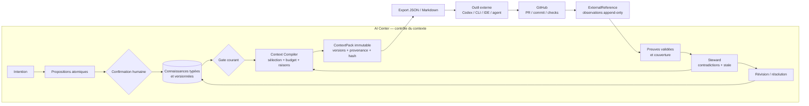
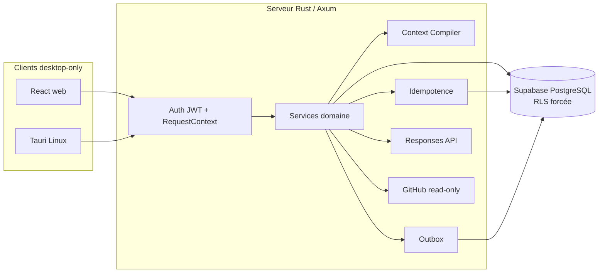

# AI Center

> **De l’intention à la preuve, sans dérive de contexte.**

AI Center est un plan de contrôle contextuel pour les projets menés avec
plusieurs équipes, agents IA et outils spécialisés. Il transforme les échanges
en connaissances confirmées et versionnées, compile le contexte utile à une
tâche, formalise les passages de relais et rend visibles la provenance, les
contradictions, l’obsolescence et la couverture des exigences.

AI Center n’est ni un IDE, ni un runner, ni un producteur de code. GitHub,
Linear, Notion, Figma, les bases de données, les CLI et les agents spécialisés
restent canoniques pour ce qu’ils produisent. AI Center conserve et transmet le
contexte partagé, puis rattache les résultats externes à des références et à des
preuves contrôlables.

## Démarrer et configurer ses fournisseurs

Sous Linux, depuis le dossier de ce dépôt :

```bash
./dev
```

Le lanceur démarre la base, le serveur et l'application. Ouvrir **Réglages IA**
pour ajouter plusieurs connexions OpenAI, Anthropic, Kimi, DeepSeek ou
OpenRouter, puis choisir **Connexion utilisée**. Les clés personnelles sont
saisies dans l'application et chiffrées côté serveur. Les abonnements locaux
compatibles et leurs limites sont présentés au même endroit.

Voir le [guide de démarrage](docs/development.md), le
[parcours des connexions](docs/product/06-personal-ai-connections.md) et la
[recette manuelle](specs/provider-connections/manual-verification.md).
Le [rapport de validation du 7 septembre](specs/provider-connections/validation-2026-09-07.md)
présente les tests unitaires, les intégrations PostgreSQL et la clôture des
revues Standards/Spec.
Cette évolution du 7 septembre est livrée localement : sa validation repose
sur les tests unitaires et d'intégration. Le propriétaire réalise les E2E et
les essais avec ses comptes fournisseurs ; aucun résultat réel n'est présumé.

## Socle Alpha Context Proof — état au 8 septembre 2026

Le socle logiciel et les connexions IA personnelles sont réunis sur
`feat/alpha-context-proof`, avec suivi dans l'[issue #2](https://github.com/gneed49/ai-center/issues/2).
La [PR #1](https://github.com/gneed49/ai-center/pull/1) est ouverte et prête
pour revue ; sa version publique reste à `91dc76b`, après la publication
explicitement autorisée du 5 septembre. Les connexions du 7 septembre et les
corrections suivantes restent locales. Aucun déploiement ou release n'a eu lieu.

| Contrôle daté                        | Preuve et limite                                                                                                                             |
| ------------------------------------ | -------------------------------------------------------------------------------------------------------------------------------------------- |
| Connexions, 7 septembre              | 125 unités Rust, 49 tests web, 32 pgTAP et 11 intégrations PostgreSQL ; comptes/processus fournisseurs simulés.                              |
| Fiabilité, 8 septembre               | 7 intégrations DB ciblées, dont le refus d'un nouveau contenu sous une identité de message déjà utilisée ; faux moteur, base réelle jetable. |
| Upgrade, 8 septembre                 | 7 unités de migration et 17 gardes ; les 5 migrations passent sur les données legacy avec owners conservés.                                  |
| Restauration, 8 septembre            | 41 tables, 98 policies et données/grants/RLS concordants ; déchiffrement après restauration avec clé maîtresse séparée non rejoué.           |
| Harness, 8 septembre                 | 41 tests Alpha, dont 14 nouveaux tests transport ; redirections refusées, taille et délai bornés, appels loopback uniquement.                |
| Qualité, 8 septembre                 | Clippy serveur tous targets, formatage et syntaxe réussis. Les suites complètes du 7 septembre ne sont pas recomptées comme nouvelles.       |
| CI publique, 5 septembre, relue le 8 | Desktop CI 5/5 et OCI 3/3 pour chacun des déclenchements push/PR à `91dc76b` ; aucun résultat distant sur les changements locaux suivants.   |

Le [rapport du 8 septembre](specs/alpha-context-proof/review-2026-09-08.md)
conserve les versions, deux axes de revue, journaux et limites. Le
[rapport du 5 septembre](specs/alpha-context-proof/review-2026-09-05.md)
conserve les anciennes preuves navigateur et build Tauri. L'[audit courant](docs/current-state-audit.md)
sépare la présence du code, les tests locaux, la CI publique et l'usage réel.

Les E2E, l'exploration UI et le smoke métier natif de la version actuelle sont
confiés au propriétaire. Restent également à réaliser la campagne comparative
sur trois projets autorisés, la GitHub App privée, dix boucles pendant une
semaine puis l'alpha HTTPS de deux à trois utilisateurs pendant deux semaines.
Le [registre propriétaire](specs/alpha-context-proof/owner-proof-template.md)
et le [dossier opérateur](docs/operations/private-alpha-handoff.md) préparent
ces étapes sans inventer de résultats. Android/iOS restent hors de ce jalon.

La migration des observations et le serveur doivent être mis à niveau ensemble ;
voir les [consignes de migration](specs/alpha-context-proof/review-2026-09-05.md#migration-et-exploitation).

## Proposition de valeur

AI Center doit démontrer qu’un projet agentique devient plus fiable lorsque :

1. l’intention devient une connaissance atomique confirmée, versionnée et
   sourcée, plutôt qu’un simple transcript ;
2. chaque tâche reçoit un `ContextPack` sélectif, explicable et immutable ;
3. le contexte est transmis à l’outil externe sans reconstruire manuellement le
   raisonnement ;
4. le résultat externe est rattaché à une référence durable et observée ;
5. une preuve validée met à jour la couverture des exigences ;
6. les contradictions et les dépendances obsolètes sont visibles et peuvent
   entraîner une vraie révision du contexte.

La doctrine est **intégrer avant de remplacer** et **référencer avant de
dupliquer**.

## Flow cible de bout en bout



Les sources Mermaid détaillées sont versionnées dans
[`docs/architecture`](docs/architecture/README.md) :

- [flow contextuel de bout en bout](docs/architecture/context-control-flow.md) ;
- [cycle de vie d’un ContextPack](docs/architecture/context-pack-lifecycle.md) ;
- [séquence export → outil → GitHub → preuve](docs/architecture/external-proof-sequence.md).

La [vue FigJam Alpha Context Proof éditable](https://www.figma.com/board/gn5z1F1tnQpQ23580fQ5QC?node-id=7-213)
complète le flow versionné ; sa structure et son rendu ont été vérifiés le
[8 septembre 2026](docs/architecture/diagram-validation-2026-09-08.md).
Le dessin antérieur « Plan simulé » reste conservé à côté comme historique.
Mermaid est la source versionnée ; les exports prêts à partager restent
disponibles en
[SVG](docs/architecture/assets/alpha-context-control-flow.svg) et
[PNG](docs/architecture/assets/alpha-context-control-flow.png).

## Capacités — preuves historiques du 5 septembre

Les deux tableaux suivants décrivent le point de contrôle du 5 septembre et
ses versions de preuve. Les livraisons des 7/8 septembre ont leurs résultats
datés plus haut ; la recette E2E de la version actuelle reste au propriétaire.

| Domaine                 | État de preuve                          | Réalité actuelle                                                                      |
| ----------------------- | --------------------------------------- | ------------------------------------------------------------------------------------- |
| Projets et sessions     | `Vérifié` sur DB/API et navigateur réel | routes project-scoped, rôle RLS, persistance et propositions structurées              |
| Validation humaine      | `Vérifié` sur PostgreSQL                | confirmation/rejet, versions, provenance et non-invention de source                   |
| Gate et Feature Brief   | `Vérifié` sur PostgreSQL                | gate lié à la graph version et livrable sourcé                                        |
| ContextPack             | `Vérifié` en unité, DB et navigateur    | sélection, exclusions, budget, raisons, versions, stale et digest                     |
| Handoff et session Tech | `Vérifié` full-stack                    | pack explicite, blocage stale/hors projet et restauration après reload                |
| Plan technique          | `Vérifié` avec double déterministe      | sortie structurée fondée uniquement sur le pack ; qualité OpenAI réelle non certifiée |
| Couverture et preuves   | `Vérifié` en DB/UI mockée               | couverture persistante et états de preuve ; GitHub live absent                        |
| Steward et résolution   | `Vérifié` sur PostgreSQL                | contradictions multiples, résolution atomique, stale, outbox et recompilation         |
| Auth et workspaces      | `Vérifié` en smoke Supabase et pgtap    | magic link/JWT/JWKS, rôles, contexte transactionnel et refus de workspace forgé       |
| GitHub read-only        | `Vérifié` contre faux serveur           | URL/SSRF/SHA/ETag/checks et transitions ; aucune installation GitHub App réelle       |
| Web desktop             | `Vérifié`                               | 126 tests mockés ; flow full-stack antérieur au point `37921d8`                       |
| Tauri Linux             | `Vérifié` au build                      | binaire release sans bundle ; smoke métier natif interactif non exécuté               |

## Dix parcours de certification

Le contrat complet associe état initial, action, mutation, preuve, erreur, retry
et reload à chaque parcours dans la
[`spécification Alpha Context Proof`](specs/alpha-context-proof/spec.md).

| ID    | Parcours                                       | Preuve au point du 5 septembre                             |
| ----- | ---------------------------------------------- | ---------------------------------------------------------- |
| UF-01 | Créer un projet                                | `Vérifié` full-stack et RLS                                |
| UF-02 | Confirmer ou rejeter une connaissance          | `Vérifié` en DB et UI                                      |
| UF-03 | Bloquer puis passer le gate courant            | `Vérifié` en DB et UI                                      |
| UF-04 | Compiler, expliquer et exporter un ContextPack | `Vérifié` en unité, DB et UI                               |
| UF-05 | Réaliser et restaurer le handoff               | `Vérifié` full-stack avec reload                           |
| UF-06 | Produire plan et couverture depuis le pack     | `Vérifié` déterministe ; OpenAI qualitatif non certifié    |
| UF-07 | Détecter puis décider sur un insight           | `Vérifié` déterministe via outbox                          |
| UF-08 | Résoudre, rendre stale et recompiler           | `Vérifié` transactionnellement sur PostgreSQL              |
| UF-09 | Importer et valider une preuve GitHub          | `Vérifié` contre faux GitHub ; live non certifié           |
| UF-10 | Reprendre sans perte, doublon ni fuite         | `Vérifié` par DB crash/replay, RLS et tests desktop mockés |

## Architecture du snapshot



- **Frontend** : React 19, TypeScript, Vite, React Router, TanStack Query,
  Tailwind CSS et composants shadcn/ui.
- **Backend** : Rust, Axum, SQLx, sorties structurées de la Responses API et
  adapter GitHub App read-only.
- **Données** : schéma privé `app`, 39 tables, connaissances versionnées,
  sélections de pack, model runs, outbox, idempotence et références externes.
- **Sécurité** : JWT Supabase vérifié côté serveur, workspace recoupé avec le
  membership, rôle PostgreSQL runtime attendu `NOBYPASSRLS`, RLS forcée.
- **Desktop** : web central et enveloppe Tauri Linux sur la même API.

## Structure du dépôt

| Chemin                                                           | Rôle                                                               |
| ---------------------------------------------------------------- | ------------------------------------------------------------------ |
| [`apps/web`](apps/web)                                           | Client React et scénarios Playwright desktop                       |
| [`apps/server`](apps/server)                                     | API Axum, auth, domaine, moteur contextuel et connecteurs          |
| [`apps/desktop`](apps/desktop)                                   | Enveloppe Tauri Linux ; les artefacts mobiles existants sont gelés |
| [`supabase`](supabase)                                           | Schéma déclaratif, migrations, seed et tests pgtap                 |
| [`specs/alpha-context-proof`](specs/alpha-context-proof/spec.md) | Exigences ACP, plan, validation et campagne comparative            |
| [`docs/architecture`](docs/architecture/README.md)               | Diagrammes Mermaid de référence                                    |
| [`docs/product`](docs/product/README.md)                         | Vision, personas, scope et différenciation                         |
| [`docs/decisions`](docs/decisions/README.md)                     | Décisions durables de produit et d’architecture                    |
| [`docs/source-material`](docs/source-material)                   | Corpus d’origine conservé comme référence immuable                 |

Ordre de lecture recommandé :

1. [reconnaissance complète](docs/current-state-audit.md) ;
2. [spécification Alpha Context Proof](specs/alpha-context-proof/spec.md) ;
3. [plan d’implémentation](specs/alpha-context-proof/plan.md) ;
4. [protocole de validation](specs/alpha-context-proof/validation.md) ;
5. [vision produit](docs/product/02-product-vision.md) ;
6. [ADR — Piloter le contexte sans remplacer les outils](docs/decisions/0005-context-control-not-tool-replacement.md).

## Validation locale desktop-only

Prérequis : Node.js, Rust et les dépendances système Tauri Linux. Docker est
nécessaire uniquement aux validations PostgreSQL/Supabase.

```bash
npm ci

npm run lint -w @ai-center/web
npm run test -w @ai-center/web
npm run build:web

cargo test -p ai-center-server --lib --offline

```

Les commandes E2E ci-dessous sont laissées au propriétaire pour sa recette :

```bash
npm run test:e2e -w @ai-center/web -- --project=chromium-desktop
npm run test:e2e -w @ai-center/web -- --project=chromium-compact
npm run test:e2e -w @ai-center/web -- --project=firefox-desktop

./scripts/ci-desktop.sh desktop
```

Le script [`scripts/ci-desktop.sh`](scripts/ci-desktop.sh) décrit les gates de
qualité, d’intégration, de navigateur, de desktop et de secret scan. La CI de PR
utilise `chromium-desktop`; la certification pré-alpha manuelle ajoute
`chromium-compact` et `firefox-desktop`. La CI publique de `91dc76b` a été relue le 8 septembre ; elle ne certifie pas
les modifications locales suivantes. La certification pré-alpha manuelle reste
`Présent mais non reproduit`.

Les évaluations IA réelles ne sont jamais lancées en CI de PR. Leur harness et
leurs schémas sont documentés dans
[`specs/alpha-context-proof/evaluation`](specs/alpha-context-proof/evaluation/README.md).

## Gates encore ouverts

Les constats de revue sont corrigés et leurs régressions passent. L’alpha
équipe reste interdite tant que les points suivants ne sont pas reproduits :

1. vérifier la configuration et le budget du projet OpenAI dédié, calibrer le modèle puis
   réussir la campagne A/B sur les trois projets autorisés ;
2. installer la GitHub App privée read-only et fermer une boucle réelle PR →
   ExternalReference → preuve → couverture ;
3. réaliser, par le propriétaire, les E2E et la certification pré-alpha manuelle,
   puis le smoke métier interactif dans Tauri Linux ;
4. réaliser dix boucles propriétaires réelles ;
5. déployer la surface HTTPS privée, vérifier alertes et restauration dans cet
   environnement, puis mener le dogfood et l’alpha équipe.

Le contrôle OpenAI du 25 août avait renvoyé `insufficient_quota`, persisté
comme `provider_quota` puis rejoué sans second appel. Il s’agit d’une preuve
historique ; les credentials et le quota actuels n’ont pas été recontrôlés.

La release visée après succès est `v0.2.0-alpha.1`, limitée au web desktop,
Tauri Linux, un workspace privé et GitHub read-only.

## Licence

Aucune licence open source n’est actuellement accordée. La visibilité d’un
dépôt ne rend pas automatiquement son contenu réutilisable.
