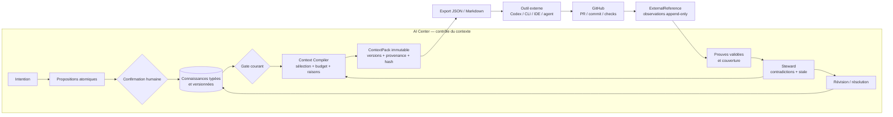
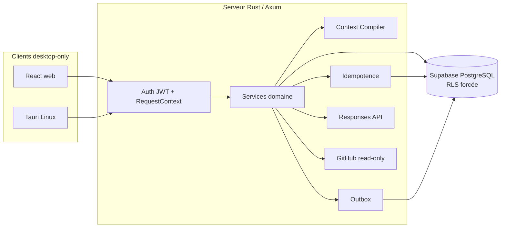

# AI Center

> **De l’intention à la preuve, sans dérive de contexte.**

AI Center est un plan de contrôle contextuel pour les projets menés avec
plusieurs équipes, agents IA et outils spécialisés. Il transforme les échanges
en connaissances confirmées et versionnées, compile le contexte utile à une
tâche, formalise les passages de relais et rend visibles la provenance, les
contradictions, l’obsolescence et la couverture des exigences.

AI Center n’est ni un IDE, ni un runner, ni un producteur de code. GitHub,
Linear, Notion, Figma, les bases de données, les CLI et les agents spécialisés
restent canoniques pour ce qu’ils produisent. AI Center conserve et transmet le
contexte partagé, puis rattache les résultats externes à des références et à des
preuves contrôlables.

## État réel au 25 août 2026

Le dépôt contient une consolidation **Alpha Context Proof en cours** sur
[`feat/alpha-context-proof`](https://github.com/gneed49/ai-center/tree/feat/alpha-context-proof),
proposée par la [PR draft #1](https://github.com/gneed49/ai-center/pull/1) vers
`main`. Ce README décrit cette branche candidate et son registre de preuves ;
il ne la présente ni comme une release ni comme `v0.2.0-alpha.1` avant le
franchissement des gates réels.

Toute affirmation utilise l’un des quatre statuts suivants :

| Statut                       | Sens                                                                                                               |
| ---------------------------- | ------------------------------------------------------------------------------------------------------------------ |
| `Vérifié`                    | Reproduit dans la validation courante, localement ou en CI, avec une commande, un scénario ou un run identifiable. |
| `Présent mais non reproduit` | Le code ou l’artefact existe, mais le comportement complet n’a pas été reproduit dans l’environnement courant.     |
| `Déclaré`                    | Rapporté par une source antérieure sans preuve courante suffisante.                                                |
| `Futur`                      | Attendu par le plan, mais pas encore livré ou exécuté.                                                             |

La [reconnaissance détaillée](docs/current-state-audit.md) conserve le registre
de preuve et les limites de chaque résultat.

### Vérifié localement

| Surface                     | Preuve courante                                                            | Portée exacte                                                                                     |
| --------------------------- | -------------------------------------------------------------------------- | ------------------------------------------------------------------------------------------------- |
| Frontend                    | lint, 4/4 tests Vitest et build web réussis                                | Qualité statique, logique UI ciblée et compilation                                                |
| Parcours desktop mockés     | 57/57 tests Playwright                                                     | 19 scénarios sur Chromium `1440×900`, Chromium `1024×768` et Firefox `1440×900`                   |
| Parcours desktop full-stack | 1/1 Playwright sur Chromium `1440×900`                                     | Projet → connaissances → gate → ContextPack → handoff → reload sur Axum/PostgreSQL réels          |
| PostgreSQL/RLS              | upgrade baseline→alpha, reset neuf, 32/32 pgtap et 6/6 tests d’intégration | rôle `ai_center_runtime` NOBYPASSRLS, stale/concurrence, outbox, model runs et crash/idempotence  |
| Authentification            | smoke magic link Supabase réel                                             | lecture viewer `200`, mutation `403`, workspace forgé `403`, sans bearer `401`, nettoyage vérifié |
| Sauvegarde                  | dump puis restauration isolée                                              | 39 tables, 96 policies, comparaison structure/données et aucune base temporaire résiduelle        |
| Backend                     | suite Rust, Clippy strict et compilation workspace réussis                 | provider structuré, compiler, idempotence atomique, outbox/steward et GitHub read-only            |
| Desktop Linux               | build Tauri release `--no-bundle` réussi                                   | binaire Linux produit ; smoke métier natif interactif encore ouvert                               |
| Évaluation                  | 9/9 tests offline du harness, budget 10/70/20 et seuils A/B                | mécanique de campagne certifiée ; aucune comparaison IA réelle                                    |

Les 57 scénarios Playwright mockés prouvent les états, blocages, retries,
reloads, erreurs et frontières frontend. Le scénario full-stack prouve en plus
la boucle heureuse navigateur → Axum → rôle PostgreSQL RLS. Les erreurs et
reprises durables sont certifiées séparément au niveau PostgreSQL ; GitHub et
la qualité sémantique OpenAI restent hors de cette preuve.

### Vérifié dans GitHub Actions

Le commit `2162d60` de la PR draft #1 a été reproduit sur des runners GitHub
Actions neufs le 25 août 2026 :

| Workflow   | Preuve distante                                                          | Résultat exact                                                                                                  |
| ---------- | ------------------------------------------------------------------------ | --------------------------------------------------------------------------------------------------------------- |
| Desktop CI | [run #20](https://github.com/gneed49/ai-center/actions/runs/32876961859) | `Vérifié` — 5/5 jobs : qualité web/Rust, PostgreSQL, Chromium desktop, Tauri Linux et audit dépendances/secrets |
| OCI images | [run #19](https://github.com/gneed49/ai-center/actions/runs/32876961945) | `Vérifié` — 3/3 jobs : policy de packaging, image API et image web                                              |

Le job PostgreSQL distant inclut base neuve, migrations, 32 assertions pgtap,
6 tests d’intégration, backup/restore, magic link et parcours full-stack. Le
job `cargo audit` est vert avec l’exception documentée
`RUSTSEC-2023-0071`, limitée à l’arête `sqlx-mysql` inactive ; SQLx est compilé
avec les seules features PostgreSQL requises. Cette réussite ne vaut ni
campagne IA réelle ni certification pré-alpha manuelle.

### Présent mais non reproduit

| Capacité                | Ce qui est présent et vérifié localement                                                                                   | Ce qui manque à la preuve courante                                                           |
| ----------------------- | -------------------------------------------------------------------------------------------------------------------------- | -------------------------------------------------------------------------------------------- |
| Context Compiler        | pipeline hybride, obligations déterministes, budget de 12 000 tokens, raisons, versions et SHA-256                         | qualité de sélection sur trois projets réels et comparaison au dump brut                     |
| OpenAI réel             | credential dédiée, accès modèle, client Responses `store:false`, sorties structurées et classification durable des erreurs | le projet API répond actuellement `insufficient_quota`; aucune sortie réelle n’a été obtenue |
| Plan et steward         | opérations distinctes et boucle déterministe complète avec résolution/recompilation                                        | précision, rappel et qualité avec corpus annoté et fournisseur réel                          |
| Références externes     | API, ETag sûr, projection GitHub read-only, observations append-only et validation humaine                                 | GitHub App privée connectée, PR réelle et preuve recalculée                                  |
| Certification pré-alpha | workflow manuel compact/Firefox/Tauri et preuves locales sur ces surfaces                                                  | aucun run manuel `Pre-alpha desktop certification` n’a encore été observé                    |
| Déploiement             | images OCI portables et garde-fous secrets/auth                                                                            | environnement HTTPS privé, alertes et restauration planifiée                                 |

### Déclaré ou futur

- `Déclaré` : les validations historiques du prototype restent consultables,
  mais ne sont pas assimilées à une reproduction du snapshot actuel.
- `Futur` : campagne IA comparative sur trois projets réels, dans un budget
  maximal de 100 USD.
- `Futur` : dix boucles réelles ContextPack → outil externe → PR GitHub → preuve
  → couverture.
- `Futur` : dogfood d’une semaine, alpha privée de deux à trois utilisateurs et
  déploiement HTTPS. La sauvegarde/restauration locale est déjà `Vérifiée`.

Android, iOS et toute surface mobile sont entièrement hors du jalon : aucun
écran, build, test, viewport ou gate mobile ne doit être exécuté.

## Proposition de valeur

AI Center doit démontrer qu’un projet agentique devient plus fiable lorsque :

1. l’intention devient une connaissance atomique confirmée, versionnée et
   sourcée, plutôt qu’un simple transcript ;
2. chaque tâche reçoit un `ContextPack` sélectif, explicable et immutable ;
3. le contexte est transmis à l’outil externe sans reconstruire manuellement le
   raisonnement ;
4. le résultat externe est rattaché à une référence durable et observée ;
5. une preuve validée met à jour la couverture des exigences ;
6. les contradictions et les dépendances obsolètes sont visibles et peuvent
   entraîner une vraie révision du contexte.

La doctrine est **intégrer avant de remplacer** et **référencer avant de
dupliquer**.

## Flow cible de bout en bout



Les sources Mermaid détaillées sont versionnées dans
[`docs/architecture`](docs/architecture/README.md) :

- [flow contextuel de bout en bout](docs/architecture/context-control-flow.md) ;
- [cycle de vie d’un ContextPack](docs/architecture/context-pack-lifecycle.md) ;
- [séquence export → outil → GitHub → preuve](docs/architecture/external-proof-sequence.md).

Le [flowchart FigJam éditable](https://www.figma.com/board/gn5z1F1tnQpQ23580fQ5QC?utm_source=other&utm_content=edit_in_figjam&oai_id=v1%2Fw4Op3Y3yGzQaNiGag9bVe9tyqgyd72pnQ7P1yHakH4IGC28Jc0zH6q&request_id=30a987bf-c867-40eb-9df4-fdb761c7b90d)
reste un support visuel complémentaire ; Mermaid est la source versionnée. Les
exports prêts à partager sont disponibles en
[SVG](docs/architecture/assets/alpha-context-control-flow.svg) et
[PNG](docs/architecture/assets/alpha-context-control-flow.png).

## Capacités du snapshot

| Domaine                 | État de preuve                          | Réalité actuelle                                                                      |
| ----------------------- | --------------------------------------- | ------------------------------------------------------------------------------------- |
| Projets et sessions     | `Vérifié` sur DB/API et navigateur réel | routes project-scoped, rôle RLS, persistance et propositions structurées              |
| Validation humaine      | `Vérifié` sur PostgreSQL                | confirmation/rejet, versions, provenance et non-invention de source                   |
| Gate et Feature Brief   | `Vérifié` sur PostgreSQL                | gate lié à la graph version et livrable sourcé                                        |
| ContextPack             | `Vérifié` en unité, DB et navigateur    | sélection, exclusions, budget, raisons, versions, stale et digest                     |
| Handoff et session Tech | `Vérifié` full-stack                    | pack explicite, blocage stale/hors projet et restauration après reload                |
| Plan technique          | `Vérifié` avec double déterministe      | sortie structurée fondée uniquement sur le pack ; qualité OpenAI réelle non certifiée |
| Couverture et preuves   | `Vérifié` en DB/UI mockée               | couverture persistante et états de preuve ; GitHub live absent                        |
| Steward et résolution   | `Vérifié` sur PostgreSQL                | contradictions multiples, résolution atomique, stale, outbox et recompilation         |
| Auth et workspaces      | `Vérifié` en smoke Supabase et pgtap    | magic link/JWT/JWKS, rôles, contexte transactionnel et refus de workspace forgé       |
| GitHub read-only        | `Vérifié` contre faux serveur           | URL/SSRF/SHA/ETag/checks et transitions ; aucune installation GitHub App réelle       |
| Web desktop             | `Vérifié`                               | 57 tests mockés et un flow full-stack Chromium ; aucun mobile                         |
| Tauri Linux             | `Vérifié` au build                      | binaire release sans bundle ; smoke métier natif interactif non exécuté               |

## Dix parcours de certification

Le contrat complet associe état initial, action, mutation, preuve, erreur, retry
et reload à chaque parcours dans la
[`spécification Alpha Context Proof`](specs/alpha-context-proof/spec.md).

| ID    | Parcours                                       | Preuve actuelle                                            |
| ----- | ---------------------------------------------- | ---------------------------------------------------------- |
| UF-01 | Créer un projet                                | `Vérifié` full-stack et RLS                                |
| UF-02 | Confirmer ou rejeter une connaissance          | `Vérifié` en DB et UI                                      |
| UF-03 | Bloquer puis passer le gate courant            | `Vérifié` en DB et UI                                      |
| UF-04 | Compiler, expliquer et exporter un ContextPack | `Vérifié` en unité, DB et UI                               |
| UF-05 | Réaliser et restaurer le handoff               | `Vérifié` full-stack avec reload                           |
| UF-06 | Produire plan et couverture depuis le pack     | `Vérifié` déterministe ; OpenAI qualitatif non certifié    |
| UF-07 | Détecter puis décider sur un insight           | `Vérifié` déterministe via outbox                          |
| UF-08 | Résoudre, rendre stale et recompiler           | `Vérifié` transactionnellement sur PostgreSQL              |
| UF-09 | Importer et valider une preuve GitHub          | `Vérifié` contre faux GitHub ; live non certifié           |
| UF-10 | Reprendre sans perte, doublon ni fuite         | `Vérifié` par DB crash/replay, RLS et tests desktop mockés |

## Architecture du snapshot



- **Frontend** : React 19, TypeScript, Vite, React Router, TanStack Query,
  Tailwind CSS et composants shadcn/ui.
- **Backend** : Rust, Axum, SQLx, sorties structurées de la Responses API et
  adapter GitHub App read-only.
- **Données** : schéma privé `app`, 39 tables, connaissances versionnées,
  sélections de pack, model runs, outbox, idempotence et références externes.
- **Sécurité** : JWT Supabase vérifié côté serveur, workspace recoupé avec le
  membership, rôle PostgreSQL runtime attendu `NOBYPASSRLS`, RLS forcée.
- **Desktop** : web central et enveloppe Tauri Linux sur la même API.

## Structure du dépôt

| Chemin                                                           | Rôle                                                               |
| ---------------------------------------------------------------- | ------------------------------------------------------------------ |
| [`apps/web`](apps/web)                                           | Client React et scénarios Playwright desktop                       |
| [`apps/server`](apps/server)                                     | API Axum, auth, domaine, moteur contextuel et connecteurs          |
| [`apps/desktop`](apps/desktop)                                   | Enveloppe Tauri Linux ; les artefacts mobiles existants sont gelés |
| [`supabase`](supabase)                                           | Schéma déclaratif, migrations, seed et tests pgtap                 |
| [`specs/alpha-context-proof`](specs/alpha-context-proof/spec.md) | Exigences ACP, plan, validation et campagne comparative            |
| [`docs/architecture`](docs/architecture/README.md)               | Diagrammes Mermaid de référence                                    |
| [`docs/product`](docs/product/README.md)                         | Vision, personas, scope et différenciation                         |
| [`docs/decisions`](docs/decisions/README.md)                     | Décisions durables de produit et d’architecture                    |
| [`docs/source-material`](docs/source-material)                   | Corpus d’origine conservé comme référence immuable                 |

Ordre de lecture recommandé :

1. [reconnaissance complète](docs/current-state-audit.md) ;
2. [spécification Alpha Context Proof](specs/alpha-context-proof/spec.md) ;
3. [plan d’implémentation](specs/alpha-context-proof/plan.md) ;
4. [protocole de validation](specs/alpha-context-proof/validation.md) ;
5. [vision produit](docs/product/02-product-vision.md) ;
6. [ADR — Piloter le contexte sans remplacer les outils](docs/decisions/0005-context-control-not-tool-replacement.md).

## Validation locale desktop-only

Prérequis : Node.js, Rust et les dépendances système Tauri Linux. Docker est
nécessaire uniquement aux validations PostgreSQL/Supabase.

```bash
npm ci

npm run lint -w @ai-center/web
npm run test -w @ai-center/web
npm run build:web

cargo test -p ai-center-server --lib --offline

npm run test:e2e -w @ai-center/web -- --project=chromium-desktop
npm run test:e2e -w @ai-center/web -- --project=chromium-compact
npm run test:e2e -w @ai-center/web -- --project=firefox-desktop

./scripts/ci-desktop.sh desktop
```

Le script [`scripts/ci-desktop.sh`](scripts/ci-desktop.sh) décrit les gates de
qualité, d’intégration, de navigateur, de desktop et de secret scan. La CI de PR
utilise `chromium-desktop`; la certification pré-alpha manuelle ajoute
`chromium-compact` et `firefox-desktop`. La CI de PR et les builds OCI sont
`Vérifiés` par les runs #20 et #19 ci-dessus ; la certification pré-alpha
manuelle reste `Présent mais non reproduit`.

Les évaluations IA réelles ne sont jamais lancées en CI de PR. Leur harness et
leurs schémas sont documentés dans
[`specs/alpha-context-proof/evaluation`](specs/alpha-context-proof/evaluation/README.md).

## Gates encore ouverts

Le socle déterministe et ses principaux P0 techniques sont certifiés localement
et dans la CI de PR. L’alpha équipe reste néanmoins interdite tant que les
points suivants ne sont pas reproduits :

1. activer crédit/quota sur le projet OpenAI dédié, calibrer le modèle puis
   réussir la campagne A/B sur les trois projets autorisés ;
2. installer la GitHub App privée read-only et fermer une boucle réelle PR →
   ExternalReference → preuve → couverture ;
3. déclencher la certification pré-alpha manuelle et réaliser le smoke métier
   interactif dans Tauri Linux ;
4. réaliser dix boucles propriétaires réelles ;
5. déployer la surface HTTPS privée, vérifier alertes et restauration dans cet
   environnement, puis mener le dogfood et l’alpha équipe.

La clé dédiée est configurée localement et ignorée par Git. L’accès modèle a été
sondé sans exposer la clé, mais la première requête Responses réelle a renvoyé
`insufficient_quota`. AI Center l’a persistée comme `provider_quota`, une seule
tentative, puis a rejoué exactement la même erreur sans second appel.

La release visée après succès est `v0.2.0-alpha.1`, limitée au web desktop,
Tauri Linux, un workspace privé et GitHub read-only.

## Licence

Aucune licence open source n’est actuellement accordée. La visibilité d’un
dépôt ne rend pas automatiquement son contenu réutilisable.
