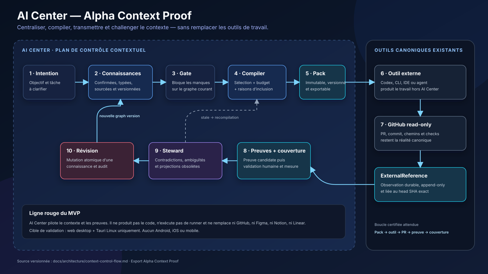

# Architecture — Alpha Context Proof

Ces diagrammes fixent les frontières du jalon `Alpha Context Proof`. Les sources
Mermaid sont versionnées avec la documentation et restent la référence pour les
exports visuels.

- [Flow contextuel de bout en bout](context-control-flow.md)
- [Cycle de vie d'un ContextPack](context-pack-lifecycle.md)
- [Séquence d'une preuve GitHub](external-proof-sequence.md)
- [Vue FigJam Alpha Context Proof éditable](https://www.figma.com/board/gn5z1F1tnQpQ23580fQ5QC?node-id=7-213),
  complément du flow de bout en bout ; [validation du 8 septembre 2026](diagram-validation-2026-09-08.md).
- Export du flow principal : [SVG](assets/alpha-context-control-flow.svg) ·
  [PNG](assets/alpha-context-control-flow.png)

Le même board conserve à côté le dessin historique « Plan simulé ». Le lien
ci-dessus ouvre directement la vue Alpha ; Mermaid reste la source versionnée.
La validation du dessin ne constitue pas une preuve d'exécution des parcours.

## Règles de lecture

- AI Center possède la connaissance partagée, les packs, la provenance, les
  références observées et les décisions de contrôle.
- L'outil externe possède la production ; GitHub possède ses repositories,
  commits, pull requests et checks.
- Une flèche vers GitHub est une lecture de métadonnées, jamais une commande en
  écriture.
- Les surfaces représentées sont web desktop et Tauri Linux. Le mobile est hors
  périmètre.

Les critères normatifs et le registre de validation se trouvent dans la
[spécification Alpha Context Proof](../../specs/alpha-context-proof/spec.md) et
son [protocole de validation](../../specs/alpha-context-proof/validation.md).
