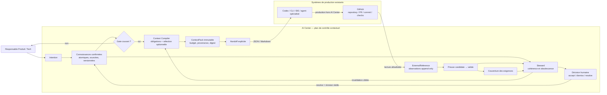

# Flow contextuel de bout en bout

## Invariants

1. Le gate, le pack et le handoff portent une graph version explicite.
2. La compilation ne peut inclure qu'une version source existante dans le même
   projet et le même workspace.
3. La session Tech ne recharge pas silencieusement le graphe complet.
4. Une preuve externe reste candidate jusqu'à validation humaine.
5. Le steward conseille et bloque ; seule une décision humaine modifie une
   connaissance confirmée.
6. AI Center n'écrit jamais dans GitHub pendant ce jalon.
