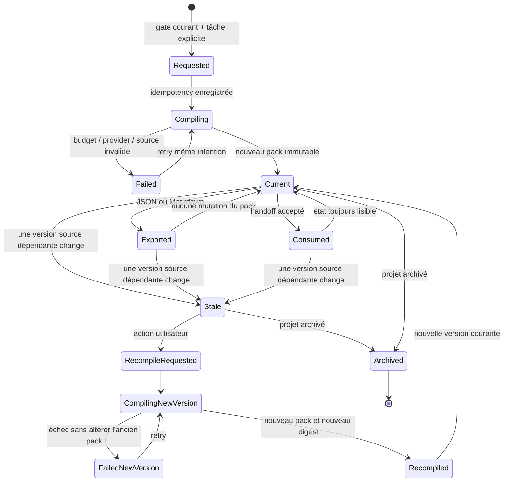

# Cycle de vie d'un ContextPack

## Règles de transition

- `Current`, `Exported`, `Consumed` et `Stale` sont des projections de statut ;
  le contenu et les sources d'une version de pack ne changent jamais.
- Une recompilation crée une nouvelle identité. Elle ne réactive pas l'ancien
  pack.
- Un handoff ou une génération depuis `Stale` est refusé ; aucun override
  utilisateur n'est disponible dans l'alpha.
- Un échec de recompilation conserve l'ancien pack stale pour l'audit.
- L'invalidation est calculée à partir des versions sources enregistrées. Le
  fallback global, s'il est nécessaire, doit être marqué et audité.
