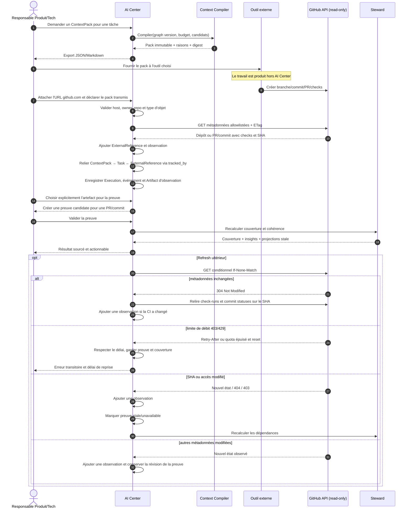

# Séquence export → outil → GitHub → preuve

## Contrat de sécurité

- Le connecteur accepte seulement des URLs HTTPS sur `github.com` et reconstruit
  lui-même l'URL d'API ; il ne suit pas une URL arbitraire fournie par le client.
- La GitHub App demande uniquement des permissions de lecture sur metadata,
  contents, pull requests, checks et commit statuses.
- L'allowlist importée exclut contenu de fichier, patch et diff.
- Une installation ou clé privée n'est jamais stockée dans une observation,
  une preuve, un log ou un export.
- Les erreurs 401, 403, 404, 429 et 5xx sont visibles, réessayables selon leur
  classe et n'effacent jamais l'état précédemment observé.

## Déclaration et historique du travail externe

L’utilisateur choisit explicitement le ContextPack qu’il confirme avoir transmis
à son outil externe. Son identifiant, sa version et son empreinte sont conservés
sur une tâche, reliée au pack et à la référence GitHub par `tracked_by`. Une
exécution `github-observation` représente uniquement l’observation de ce travail :
elle ne lance aucun outil, ne transmet pas elle-même le pack et n’écrit pas sur
GitHub. Un check vert laisse une PR ouverte en cours ; un commit observé ou une
PR fusionnée marque le travail observé terminé, sans valider sa preuve.

Une référence déjà importée peut être observée à nouveau avec cette déclaration.
La paire référence/pack crée une seule tâche et une seule exécution, y compris
avec une nouvelle clé de commande. Plusieurs packs explicitement déclarés peuvent
avoir chacun leur chaîne. Un import sans déclaration reste utilisable comme
référence historique, et n’atteste aucune transmission. Une preuve historique
sans artefact n’acquiert pas de provenance rétroactive.

Chaque nouvel état observé ajoute un artefact immutable lié à son observation
source. Les imports, rafraîchissements, limites temporaires, créations de preuves
et décisions humaines ajoutent des événements séquencés. Une reprise avec la même
clé rejoue le résultat sans doubler la chaîne, les artefacts ou les événements.
Une limite de débit conserve les artefacts et preuves précédents ; son événement
de diagnostic est ajouté une fois pour cette commande.

Pour une chaîne déclarée, la création de preuve exige un choix explicite de
l’artefact. Son SHA doit être encore observé, son pack courant dans le graphe, et
le livrable ciblé issu du même pack. La validation humaine vérifie de nouveau ces
conditions. Un changement de SHA ou une perte d’accès ajoute son observation et
conserve les anciens artefacts ; une révision du graphe rend le pack historique
visible comme obsolète et interdit de nouvelles attestations sur ce pack.

Les tables, clés étrangères composites, RLS et protections append-only existaient
déjà. La migration ACP-T08 ajoute seulement les droits du rôle runtime : lecture
et insertion des quatre tables, mise à jour des tâches/exécutions, usage de leurs
séquences. Les viewers peuvent consulter les chaînes de leur workspace, les
owners/editors peuvent enregistrer ces opérations, et aucun membre d’un autre
workspace ne peut voir ou modifier leur contenu.
