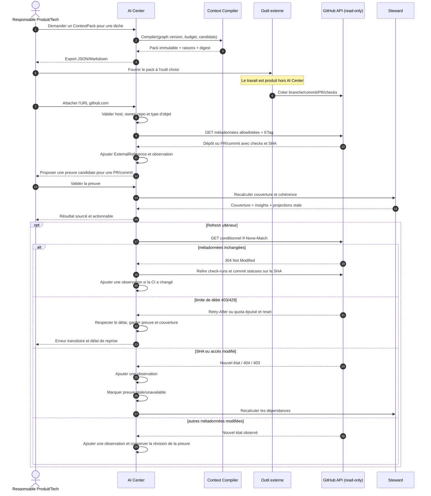

# Séquence export → outil → GitHub → preuve

## Contrat de sécurité

- Le connecteur accepte seulement des URLs HTTPS sur `github.com` et reconstruit
  lui-même l'URL d'API ; il ne suit pas une URL arbitraire fournie par le client.
- La GitHub App demande uniquement des permissions de lecture sur metadata,
  contents, pull requests, checks et commit statuses.
- L'allowlist importée exclut contenu de fichier, patch et diff.
- Une installation ou clé privée n'est jamais stockée dans une observation,
  une preuve, un log ou un export.
- Les erreurs 401, 403, 404, 429 et 5xx sont visibles, réessayables selon leur
  classe et n'effacent jamais l'état précédemment observé.
