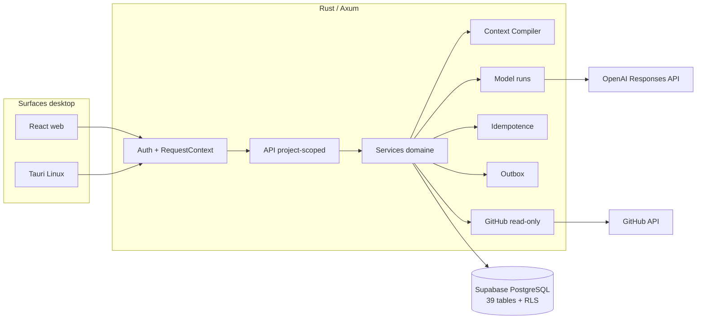

# AI Center — reconnaissance complète du snapshot Alpha Context Proof

> Date de l’audit : 25 août 2026
>
> Dépôt de référence : [`gneed49/ai-center`](https://github.com/gneed49/ai-center)
>
> Snapshot publié : `feat/alpha-context-proof`, PR draft
> [#1](https://github.com/gneed49/ai-center/pull/1) vers `main`
>
> Head de preuve CI : `2162d60`
>
> Périmètre client : web desktop et Tauri Linux uniquement

## 1. Verdict exécutif

AI Center a dépassé le stade du seul démonstrateur `Credits v2`. Le snapshot
courant contient maintenant les briques structurantes d’un plan de contrôle
contextuel :

- authentification Supabase et contexte de workspace ;
- connaissances confirmées, versionnées et sourcées ;
- `ContextPack` sélectif, explicable, budgété et immutable ;
- handoff explicitement lié à un pack courant ;
- opérations IA structurées séparées par responsabilité ;
- idempotence durable et primitives d’outbox ;
- steward, résolution par révision et invalidation ;
- références GitHub read-only, observations append-only et preuves validées
  humainement ;
- routes et états frontend project-scoped ;
- spécification, matrice de dix parcours, CI desktop et harness d’évaluation.

Cette avancée est désormais reproduite sur une stack Supabase isolée : migration
depuis une base neuve, 32 assertions pgtap, rôle runtime RLS, smoke magic link,
tests de crash/replay, cycle complet steward et parcours navigateur connecté à
Axum/PostgreSQL. Le backup a été restauré et comparé, et le binaire Tauri Linux
a été construit. Les contrats OpenAI et GitHub sont certifiés contre de faux
serveurs HTTP ; un appel OpenAI réel a atteint le fournisseur mais a été refusé
par `insufficient_quota` avant toute sortie.

Ces preuves ferment le socle déterministe, pas la preuve de valeur de l’alpha.
Aucune campagne A/B sur trois projets réels, GitHub App privée, PR issue d’un
handoff, dogfood ou surface HTTPS privée n’est encore certifiée. En revanche,
la CI de PR et les images OCI du commit `2162d60` sont reproduites et vertes
dans GitHub Actions.

Le verdict précis est donc :

> **Socle Alpha Context Proof déterministe reproduit de bout en bout avec RLS,
> crash/replay et navigateur réel ; chaîne externe OpenAI/GitHub, avantage
> comparatif et exploitation alpha encore non certifiés.**

La promotion vers une alpha équipe reste interdite jusqu’à reproduction des
gates réels décrits dans la
[`validation Alpha Context Proof`](../specs/alpha-context-proof/validation.md).

## 2. Méthode et statuts de preuve

Cette reconnaissance sépare strictement quatre niveaux :

| Statut                       | Signification                                                                                                      |
| ---------------------------- | ------------------------------------------------------------------------------------------------------------------ |
| `Vérifié`                    | Reproduit dans la validation courante, localement ou en CI, avec une commande, un scénario ou un run identifiable. |
| `Présent mais non reproduit` | Code, schéma ou artefact identifiable, mais comportement complet non exécuté dans l’environnement courant.         |
| `Déclaré`                    | Résultat rapporté par une documentation ou une validation antérieure, sans preuve courante suffisante.             |
| `Futur`                      | Attendu par le plan, mais pas encore livré ou exécuté.                                                             |

Une compilation ne prouve pas un parcours métier. Un scénario Playwright avec
API interceptée ne prouve pas PostgreSQL. Un faux provider ne prouve pas OpenAI
ou GitHub. Une policy SQL lue ne prouve pas la RLS exécutée avec les rôles
runtime. Ces distinctions sont conservées dans tout le document.

Sources inspectées :

- code React, Rust/Axum, SQLx et Tauri ;
- schémas déclaratifs, migrations, seed, rôles et tests PostgreSQL ;
- tests unitaires, tests Playwright et scripts de validation ;
- documentation produit, ADR, spécifications et diagrammes ;
- état Git local du snapshot.

Le corpus [`docs/source-material`](source-material) reste une référence
immuable. Aucun fichier synchronisé sous `sources/` n’a été modifié.

## 3. Vérité produit et frontière

AI Center vise la continuité contextuelle entre personnes, agents et outils. Il
possède :

- les connaissances partagées et leurs versions ;
- le graphe, la provenance et les contradictions ;
- les `ContextPack`, handoffs et contrats ;
- les références observées, preuves et couvertures ;
- les décisions de contrôle et l’audit.

Les outils connectés conservent :

- le code, les branches, commits, PR et checks dans GitHub/GitLab ;
- les tickets et workflows dans Linear/Jira ;
- les documents dans Notion/Confluence/Drive ;
- les designs dans Figma ;
- les données et opérations dans leurs systèmes spécialisés.

La doctrine est **intégrer avant de remplacer** et **référencer avant de
dupliquer**. Aucun écran de production de code, runner distant ou mutation
GitHub n’appartient à l’alpha.

### Cible initiale

Le premier utilisateur est un responsable Produit–Tech AI-native ou une petite
équipe qui :

- utilise déjà plusieurs agents et outils spécialisés ;
- répète trop souvent le contexte ;
- perd des décisions dans les conversations ;
- ne sait pas relier clairement résultat, exigence et preuve ;
- veut détecter contradictions et obsolescence sans remplacer sa stack.

Le solo builder reste le premier profil de dogfood, pas la limite stratégique.

## 4. État du dépôt et gouvernance

| Élément                          | Statut                       | Constat                                                                                                       |
| -------------------------------- | ---------------------------- | ------------------------------------------------------------------------------------------------------------- |
| Base distante de la PR           | `Vérifié`                    | `main` au commit `abb779c`, base enregistrée de la PR #1                                                      |
| Branche candidate                | `Vérifié`                    | `feat/alpha-context-proof`, publiée et proposée par la PR draft #1                                            |
| Socle déterministe Alpha         | `Vérifié`                    | gates déterministes, desktop et PostgreSQL reproduits ; campagne de valeur et intégrations live ouvertes      |
| CI GitHub Actions de PR          | `Vérifié`                    | Desktop CI [#20](https://github.com/gneed49/ai-center/actions/runs/32876961859), 5/5 jobs au commit `2162d60` |
| Images OCI                       | `Vérifié`                    | OCI [#19](https://github.com/gneed49/ai-center/actions/runs/32876961945), packaging + API + web verts         |
| Certification pré-alpha manuelle | `Présent mais non reproduit` | workflow compact/Firefox/Tauri versionné, sans run manuel courant                                             |
| Release `v0.2.0-alpha.1`         | `Futur`                      | promotion conditionnée à tous les gates réels                                                                 |

Conséquence : le snapshot est une base de consolidation, pas une release
consommable ni une preuve de déploiement.

## 5. Architecture du snapshot

| Couche     | Technologie et responsabilité                                        | Statut                                                        |
| ---------- | -------------------------------------------------------------------- | ------------------------------------------------------------- |
| Web        | React 19, TypeScript, Vite, React Router, TanStack Query             | `Vérifié` au lint, tests, build et Playwright mocké           |
| API        | Rust, Axum, SQLx, routes authentifiées et project-scoped             | `Vérifié` en unité, intégration PostgreSQL et navigateur réel |
| IA         | Responses API, sorties structurées, `store:false`, runs persistables | contrats `Vérifiés`; sortie OpenAI réelle bloquée par quota   |
| Données    | Supabase/PostgreSQL, schéma privé `app`, RLS forcée                  | `Vérifié` sur stack isolée avec rôle runtime                  |
| Connecteur | GitHub App read-only, allowlist de métadonnées                       | `Vérifié` en unité ; live non reproduit                       |
| Desktop    | Tauri v2 Linux réutilisant le web et la même API                     | `Vérifié` au build `--no-bundle`                              |

Les [diagrammes Mermaid versionnés](architecture/README.md) détaillent le flow
global, le cycle de vie des packs et la séquence de preuve externe.

## 6. Modèle durable

Le schéma déclaratif principal contient 39 tables. Les ajouts structurants de
l’alpha comprennent notamment :

| Domaine          | Objets principaux                                                                      |
| ---------------- | -------------------------------------------------------------------------------------- |
| Workspaces       | `workspaces`, `workspace_members`                                                      |
| Connaissance     | `knowledge_entries`, `knowledge_entry_versions`, `edges`                               |
| ContextPack      | `context_packs`, `context_pack_sources`, `context_pack_selection_items`                |
| Sessions IA      | `sessions`, `messages`, `model_runs`, `mutation_proposals`                             |
| Fiabilité        | `idempotency_records`, `domain_events`, `audit_events`                                 |
| Livrables        | `deliverables`, `deliverable_sections`, `deliverable_sources`                          |
| Pilotage externe | `tool_connections`, `external_references`, `external_reference_observations`           |
| Preuve           | `artifacts`, `evidences`, `requirement_coverage`                                       |
| Steward          | `steward_assessments`, `steward_assessment_sources`, `insights`, `insight_resolutions` |

### Isolation et rôle runtime

Sont présents :

- memberships `owner`, `editor`, `viewer` ;
- `workspace_id` et contraintes de scope sur les ressources ;
- helpers de contexte PostgreSQL ;
- RLS activée et forcée ;
- rôle cluster `ai_center_runtime` déclaré `NOSUPERUSER`,
  `NOBYPASSRLS`, `NOINHERIT` ;
- grants runtime sur allowlist, sans suppression ni DDL ;
- 32 assertions pgtap couvrant structure, triggers, index, fonctions de reprise
  et matrice RLS.

**Statut : `Vérifié`.** Une stack Supabase jetable sur ports dédiés a été créée
depuis zéro. Migration, seed, pgtap 32/32 et vérificateur de grants ont passé ;
la connexion métier a confirmé `current_user = ai_center_runtime`,
`NOBYPASSRLS`, `NOSUPERUSER` et `NOINHERIT`. La stack de développement n’a pas
été réinitialisée.

## 7. Authentification et autorisation

### Présent

- magic link Supabase côté web ;
- callback PKCE et restauration de session ;
- sélection du workspace ;
- envoi de `Authorization` et `X-AI-Center-Workspace-Id` ;
- vérification JWT/JWKS côté Axum : signature, `kid`, issuer, audience,
  expiration et subject ;
- membership recoupé côté serveur ;
- `RequestContext` injecté dans les transactions ;
- refus du mode auth local sur un bind non-loopback ;
- contrôle du rôle PostgreSQL runtime en mode Supabase.

### Preuve courante

| Contrôle                                     | Statut                             |
| -------------------------------------------- | ---------------------------------- |
| Parsing des formes d’audience JWT            | `Vérifié` par test unitaire        |
| Compilation des surfaces web/auth et serveur | `Vérifié`                          |
| Magic link réel                              | `Vérifié` par smoke Supabase local |
| JWT/JWKS réel                                | `Vérifié` sur la stack locale      |
| Rotation réelle de `kid`                     | `Présent mais non reproduit`       |
| Matrice owner/editor/viewer en DB            | `Vérifié` par pgtap                |
| Workspace forgé et mutation viewer           | `Vérifié` par HTTP `403`           |
| Requête sans bearer                          | `Vérifié` par HTTP `401`           |

Le smoke crée un utilisateur éphémère, lui attribue le rôle viewer, génère et
vérifie un magic link, puis confirme lecture autorisée, mutation refusée,
workspace forgé refusé et bearer obligatoire. Le trap supprime membership et
utilisateur ; aucune credential n’est écrite dans le dépôt.

## 8. Moteur contextuel

### Opérations structurées

L’ancien usage d’une interface unique a été découpé en responsabilités :

- réponse/extraction de connaissances ;
- sélection du contexte ;
- génération du plan technique ;
- analyse de contradictions.

Le mode OpenAI exige un modèle et une clé explicites. Les appels utilisent les
sorties structurées, `store:false`, des timeouts et des retries bornés. Le mode
réel ne doit pas basculer silencieusement vers le moteur déterministe.

**Statut : contrats `Vérifiés`, génération réelle bloquée.** La clé dédiée est
locale, ignorée et non suivie. L’accès au modèle `gpt-5.6-luna` a été sondé,
mais la première requête Responses réelle a renvoyé `insufficient_quota`.
L’application la classe maintenant `provider_quota`, permanente, avec une seule
tentative et replay durable exact. Aucune sortie fournisseur ni campagne
qualitative n’est donc déclarée réussie.

### Context Compiler

Le compilateur :

1. impose par règles les objectifs, exigences, critères, contraintes et
   questions bloquantes ;
2. soumet uniquement les candidats optionnels à la sélection IA ;
3. rejette tout UUID absent de l’ensemble candidat ;
4. enregistre un budget initial de 12 000 tokens ;
5. conserve inclusion/exclusion, motif codifié, explication et ordre ;
6. fixe versions sources, graph version, compiler version, mode et digest
   SHA-256 ;
7. ne recharge pas silencieusement tout le projet dans une session Tech.

Trois tests unitaires reproduisent la sélection/exclusion, le rejet d’un UUID
inconnu et la conservation des obligations sous petit budget.

**Statut : `Vérifié` au niveau unitaire ; `Présent mais non reproduit` sur
des projets réels et avec sélection OpenAI.**

### Plan technique

Le plan technique n’est plus le document codé en dur spécifique à `Credits
v2`. Il est produit par une opération structurée alimentée par le pack
explicite.

**Statut : `Présent mais non reproduit` avec un modèle réel.** La disparition
du simulateur spécifique est observable dans le code ; la qualité du plan n’est
pas encore une preuve d’usage.

## 9. Fiabilité transactionnelle

### Idempotence

Les commandes mutantes exigent une clé UUID. Le protocole conserve le hash
canonique de la requête, une lease et le résultat :

- même clé, même corps : replay du résultat ;
- même clé, corps ou scope différent : conflit ;
- traitement en cours : état réessayable ou reprise après expiration ;
- durée de conservation prévue : 24 heures.

Sept tests unitaires couvrent hash, collision, validation, replay et expiration.

**Statut : `Vérifié` sur PostgreSQL.** Le test injecte un rollback après
mutation et finalisation, reprend une lease expirée, simule une réponse perdue,
rejoue le corps HTTP exact et vérifie l’absence de doublons pour projet,
session, brief, pack, handoff, plan et révision. Une même clé avec un corps
différent produit `409`.

### Outbox

Les primitives comprennent lease, `FOR UPDATE SKIP LOCKED`, compteur,
backoff exponentiel borné, retry et état final. Quatre tests unitaires couvrent
la politique et les transitions.

**Statut : `Vérifié` en unité et intégration.** Le superviseur consomme les
événements par workspace, renouvelle les leases et possède un scanner
périodique de reprise après crash. `mvp_flow` vérifie qu’aucun événement
`pending` ou `processing` ne subsiste après commit et après redémarrage simulé.

### Model runs et erreurs

`model_runs` peut conserver opération, provider, modèle, versions de prompt et
schéma, graph version, sources, réponse, usage, latence, tentatives, coût estimé,
statut et erreur classifiée. Les erreurs HTTP distinguent contrat, conflit,
authentification, provider et connector.

**Statut : `Vérifié` sur PostgreSQL et faux HTTP.** Un run est visible
`running` avant le réseau, puis finalisé `completed` ou `failed` avec tentatives
et classe. Le smoke réel a persisté `provider_quota`, modèle
`gpt-5.6-luna`, `attempt_count = 1`, sans contenu fournisseur sensible.

## 10. Steward, résolution et obsolescence

Le modèle supporte :

- classifications `contradiction`, `compatible`, `ambiguous` ;
- plusieurs assessments et insights ;
- versions sources, confiance et fingerprint ;
- actions distinctes `accept`, `dismiss`, `resolve` ;
- résolution exigeant une révision réelle ;
- nouvelle graph version, audit et projections stale ;
- recompilation obligatoire avant nouvelle génération.

Le frontend vérifie avec API mockée l’attribution de l’insight à son projet, la
résolution par révision, l’affichage stale et la recompilation.

**Statut : `Vérifié` avec le moteur déterministe sur PostgreSQL.** Le flow
reproduit contradictions multiples, résolution par révision, nouvelle graph
version, invalidation, recompilation et nouvelle couverture. La précision et le
rappel avec analyse OpenAI réelle restent non prouvés.

Les seuils précision ≥ 80 % et rappel ≥ 70 % sur les contradictions restent
`Futur` jusqu’à la campagne annotée.

## 11. ExternalReference, GitHub et preuve

### Implémentation présente

L’API expose :

- création et liste des références d’un projet ;
- détail d’une référence ;
- refresh ;
- création d’une preuve candidate ;
- validation ou rejet humain de la preuve.

Le connecteur :

- accepte uniquement une URL de pull request `github.com` canonique ;
- reconstruit l’appel API depuis owner, repository et numéro validés ;
- n’exécute aucun code, diff ou contenu de fichier ;
- importe une allowlist : identité PR, état, URL, base/head SHA, commits,
  chemins modifiés, checks et dates ;
- utilise ETag et observations append-only hashées ;
- rend la preuve stale lorsque le head SHA change ;
- rend la référence unavailable sur perte d’accès ou disparition ;
- ne possède aucune opération GitHub en écriture.

Douze contrats HTTP GitHub et neuf tests ExternalReference reproduisent identité
canonique, SHA, hashes, refus anti-SSRF, transitions de preuve, états
unavailable et comportement ETag. Un `304` sur la PR ne masque jamais une
évolution des commits, fichiers ou checks : ces sous-ressources sont relues.

**Statut : `Vérifié` au niveau unitaire ; `Présent mais non reproduit` avec
une GitHub App, un dépôt privé et une PR réels.**

Aucune boucle réelle `ContextPack → outil externe → PR → ExternalReference →
preuve validée → couverture` n’est encore certifiée.

## 12. Surfaces et parcours desktop

Le web possède les surfaces de projet, sessions, livrables, handoff, historique,
Decision Inbox et NotFound. Les ressources sensibles sont project-scoped.

Le frontend gère notamment :

- identité, état, graph version et raisons de sélection du pack ;
- blocage d’une session Tech sans pack courant ;
- refus d’un gate calculé sur une ancienne graph version ;
- restauration du dernier handoff après reload ;
- erreurs différenciées et retry avec conservation de saisie ;
- attribution du projet dans la Decision Inbox ;
- état NotFound et session hors projet refusée.

### Dix parcours de certification

| ID    | Parcours                               | État de preuve courant                              |
| ----- | -------------------------------------- | --------------------------------------------------- |
| UF-01 | Créer un projet                        | `Vérifié` full-stack et RLS                         |
| UF-02 | Confirmer ou rejeter une connaissance  | `Vérifié` en DB et UI                               |
| UF-03 | Bloquer puis passer le gate courant    | `Vérifié` en DB et UI                               |
| UF-04 | Compiler et exporter un ContextPack    | `Vérifié` en unité, DB et UI                        |
| UF-05 | Créer et restaurer un handoff          | `Vérifié` full-stack avec reload                    |
| UF-06 | Produire plan et couverture            | `Vérifié` déterministe ; qualité OpenAI non prouvée |
| UF-07 | Détecter puis décider                  | `Vérifié` via outbox déterministe                   |
| UF-08 | Résoudre, rendre stale et recompiler   | `Vérifié` transactionnellement                      |
| UF-09 | Importer et valider une preuve GitHub  | `Vérifié` contre faux serveur ; live non reproduit  |
| UF-10 | Reprendre sans perte, doublon ni fuite | `Vérifié` en DB/RLS et tests UI de résilience       |

Le registre normatif complet se trouve dans
[`specs/alpha-context-proof/spec.md`](../specs/alpha-context-proof/spec.md).

## 13. Validation reproduite

### 13.1 Frontend

| Contrôle            | Résultat | Statut    |
| ------------------- | -------- | --------- |
| lint web            | réussi   | `Vérifié` |
| Vitest              | 4/4      | `Vérifié` |
| build web           | réussi   | `Vérifié` |
| Chromium `1440×900` | 19/19    | `Vérifié` |
| Chromium `1024×768` | 19/19    | `Vérifié` |
| Firefox `1440×900`  | 19/19    | `Vérifié` |

Total Playwright mocké : **57/57**. Le scénario full-stack supplémentaire
Chromium `1440×900` passe **1/1** sur Axum et PostgreSQL réels. Il traverse
création, trois connaissances confirmées, gate, ContextPack, handoff et reload,
avec zéro `pageerror`, `console.error` ou requête réseau échouée. Un contrôle
exploratoire dans le navigateur intégré a également inspecté le projet et la
provenance du pack sans erreur console.

Limite : les 57 scénarios multi-navigateurs utilisent `mock-api.ts`. Ils
vérifient les contrats et états frontend ; le scénario full-stack séparé est la
preuve Axum/PostgreSQL réelle.

### 13.2 Rust et desktop

| Contrôle                                 | Résultat                  | Statut             |
| ---------------------------------------- | ------------------------- | ------------------ |
| `cargo test --workspace --lib --offline` | 75/75                     | `Vérifié`          |
| quatre binaires d’intégration PostgreSQL | 6/6                       | `Vérifié`          |
| `cargo clippy --workspace --all-targets` | réussi avec `-D warnings` | `Vérifié`          |
| Tauri Linux release `--no-bundle`        | réussi, ELF x86-64        | `Vérifié` au build |
| smoke métier natif interactif            | non exécuté               | `Futur`            |

Les 75 tests couvrent notamment contrats OpenAI/GitHub, compilateur, auth,
idempotence, outbox et steward. Les six tests PostgreSQL sont répartis entre
`mvp_flow` 1/1, `idempotency_atomicity` 2/2, `model_run_lifecycle` 1/1 et
`context_pack_concurrency` 2/2. Ce dernier prouve qu’une réponse Tech est
rejetée si son pack est supersédé en vol et qu’un handoff se sérialise avec une
recompilation concurrente.

### 13.3 Documentation, CI et évaluation

| Contrôle                                        | Résultat                    | Statut                             |
| ----------------------------------------------- | --------------------------- | ---------------------------------- |
| schémas JSON du harness                         | valides                     | `Vérifié`                          |
| tests offline du runner live                    | 9/9                         | `Vérifié` comme harness uniquement |
| budget 10/70/20 et arrêt avant dépassement      | testé                       | `Vérifié`                          |
| faits critiques 100 % + rappel pertinent ≥ 85 % | calculs distincts           | `Vérifié` dans le harness          |
| workflow PR desktop                             | 5/5 jobs, run #20           | `Vérifié`                          |
| workflow OCI                                    | 3/3 jobs, run #19           | `Vérifié`                          |
| workflow manuel compact/Firefox/Tauri           | fichier présent, aucun run  | `Présent mais non reproduit`       |
| campagne OpenAI réelle                          | bloquée par quota et corpus | `Futur`                            |

### 13.4 PostgreSQL, auth et restauration

| Contrôle                             | Résultat                                                             | Statut                       |
| ------------------------------------ | -------------------------------------------------------------------- | ---------------------------- |
| base neuve baseline → alpha + seed   | réussi sur stack isolée                                              | `Vérifié`                    |
| pgtap                                | 32/32                                                                | `Vérifié`                    |
| rôle/grants runtime                  | vérificateur réussi, `ai_center_runtime` NOBYPASSRLS                 | `Vérifié`                    |
| flow contextuel et reprise outbox    | `mvp_flow` 1/1                                                       | `Vérifié`                    |
| crash/replay/idempotence/provider    | `idempotency_atomicity` 2/2                                          | `Vérifié`                    |
| cycle durable `model_runs`           | 1/1                                                                  | `Vérifié`                    |
| magic link et viewer/workspace forgé | `200/200/403/403/401`                                                | `Vérifié`                    |
| backup/restore                       | 39 tables, 96 policies, hash logique identique, zéro base résiduelle | `Vérifié`                    |
| ExternalReference DB + faux HTTP     | unités et raccord compilé ; pas de GitHub App réelle                 | `Présent mais non reproduit` |

### 13.5 Exclusions respectées

- aucun test Android ;
- aucun build Android ;
- aucun viewport mobile ;
- aucune certification iOS ;
- aucune évaluation IA réelle en CI ;
- aucune écriture GitHub.

## 14. CI desktop-only

Le workflow de PR prévoit :

- format, liens, Prettier, lint, Clippy, tests Rust/web et builds ;
- secret scan ;
- stack Supabase isolée, reset et test d’intégration ;
- Chromium desktop ;
- build Tauri Linux ;
- audit npm/cargo.

Le workflow manuel pré-alpha ajoute Chromium compact et Firefox desktop avant le
smoke Tauri.

**Statut de la CI de PR : `Vérifié`.** Le
[run Desktop CI #20](https://github.com/gneed49/ai-center/actions/runs/32876961859)
termine ses cinq jobs avec succès au commit `2162d60` : qualité web/Rust,
PostgreSQL, Chromium desktop, Tauri Linux et audit dépendances/secrets. Le job
PostgreSQL inclut migration, pgtap, 6/6 tests d’intégration, backup/restore,
magic link et parcours full-stack. L’audit cargo conserve une exception
documentée pour `RUSTSEC-2023-0071`, inaccessible avec les features SQLx
PostgreSQL effectivement compilées.

Le [run OCI #19](https://github.com/gneed49/ai-center/actions/runs/32876961945)
est également `Vérifié` : policy de packaging, image API et image web passent.
La PR reste draft et le workflow manuel pré-alpha compact/Firefox/Tauri reste
`Présent mais non reproduit` ; ces runs ne prouvent ni fournisseur live ni
déploiement alpha.

## 15. Ce qui n’est pas encore prouvé

### Sécurité et persistance

- rotation JWKS réelle et environnement HTTPS déployé ;
- restauration sur l’environnement cible de l’alpha, au-delà du smoke local ;
- campagne longue de concurrence et reprise après indisponibilité complète.

### Valeur contextuelle

- qualité de sélection du pack sur trois projets réels ;
- présence de 100 % des faits critiques ;
- rappel pertinent ≥ 85 % et non-pertinent ≤ 20 % ;
- réduction médiane de tokens ≥ 30 % ;
- au moins 8 handoffs sur 10 sans reformulation majeure ;
- préférence du ContextPack ≥ 70 % face au dump brut.

### IA et steward

- sorties OpenAI réelles valides ≥ 95 % après retries ; le projet dédié doit
  d’abord recevoir un quota/crédit actif ;
- qualité des plans sur des tâches non seedées ;
- contradictions : précision ≥ 80 %, rappel ≥ 70 % ;
- absence de source inventée en conditions réelles ;
- coûts et latences réels.

### Intégrations et opérations

- GitHub App privée connectée à un dépôt réel ;
- changement réel de head SHA et preuve stale ;
- dix PR réelles issues d’un handoff ;
- déploiement HTTPS privé ;
- dogfood d’une semaine puis alpha équipe de deux semaines ;
- alertes et restauration sur l’hébergement privé.

## 16. Campagne comparative

Le harness versionné prépare :

- exactement trois projets autorisés, dont AI Center ;
- au moins 12 tâches de handoff annotées ;
- 60 paires : 20 contradictions, 20 compatibles, 20 ambiguës ;
- conditions A `ContextPack` et B dump brut ;
- même modèle, même tâche et même contrat ;
- trois répétitions, cinq uniquement en cas d’instabilité ;
- budget maximal global de 100 USD ;
- résultats bruts privés et agrégats expurgés versionnables.

Le run synthétique vérifie le mécanisme de calcul, pas la proposition de valeur.
La campagne réelle est `Futur` tant qu’un corpus privé approuvé, un provider
réel et une revue humaine n’ont pas été utilisés.

## 17. Gates de promotion

L’alpha équipe est interdite si un seul des points suivants subsiste :

- fuite inter-projet ou inter-workspace ;
- perte d’une connaissance confirmée ;
- duplication après retry ;
- source inventée ;
- insight résolu sans mutation réelle ;
- génération depuis un pack stale ;
- écriture GitHub ;
- secret dans logs, erreurs, DB ou dépôt ;
- SSRF ;
- backup non restaurable ;
- P0 sans happy/error/retry/reload réel ;
- aucun avantage mesurable face au dump brut.

### Ordre de travail restant

1. déclencher la certification pré-alpha manuelle compact/Firefox/Tauri ;
2. activer crédit/quota OpenAI, calibrer jusqu’à deux modèles et figer le plus
   économique atteignant les seuils ;
3. fournir les deux projets réels supplémentaires, consentements et annotations,
   puis exécuter la campagne A/B ;
4. installer la GitHub App privée read-only et fermer dix boucles avec de vraies
   PR ;
5. exécuter le smoke métier natif Tauri, déployer en HTTPS privé et mener le
   dogfood ;
6. corriger tout P0, rejouer les validations touchées et seulement alors
   produire `v0.2.0-alpha.1`.

## 18. Verdict sur la proposition de valeur

Le snapshot démontre désormais que l’architecture peut représenter la chaîne de
contrôle voulue et que l’interface sait guider ses états critiques. Il ne
démontre pas encore que le `ContextPack` apporte un avantage mesurable face au
workflow « dump brut + chat » dans des projets réels.

| Question                                              | Réponse actuelle                                              |
| ----------------------------------------------------- | ------------------------------------------------------------- |
| Le produit est-il clairement centré sur le contexte ? | Oui — `Vérifié` dans les contrats, docs et surfaces           |
| Le socle technique du flow existe-t-il ?              | Oui — `Vérifié` en DB, API, navigateur réel et tests de crash |
| L’isolation organisationnelle est-elle certifiée ?    | Oui localement — RLS/runtime/pgtap et HTTP forgé `Vérifiés`   |
| La sélection IA est-elle qualitativement prouvée ?    | Non — campagne réelle `Futur`                                 |
| La boucle GitHub read-only est-elle prouvée en live ? | Non — unités `Vérifiées`, accès live non reproduit            |
| L’alpha équipe peut-elle commencer ?                  | Non — gates réels encore ouverts                              |

La prochaine décision ne doit donc pas porter sur une extension V1. Elle doit
porter sur la fermeture des preuves réelles de l’Alpha Context Proof.

## 19. Index documentaire

| Document                                                                  | Rôle                                      |
| ------------------------------------------------------------------------- | ----------------------------------------- |
| [README racine](../README.md)                                             | point d’entrée et état de preuve condensé |
| [Spécification Alpha](../specs/alpha-context-proof/spec.md)               | exigences ACP et dix parcours             |
| [Plan Alpha](../specs/alpha-context-proof/plan.md)                        | séquencement, gates et dépendances        |
| [Validation Alpha](../specs/alpha-context-proof/validation.md)            | protocole, seuils et registre de preuve   |
| [Architecture](architecture/README.md)                                    | diagrammes Mermaid versionnés             |
| [Harness d’évaluation](../specs/alpha-context-proof/evaluation/README.md) | campagne A/B, schémas et budget           |
| [Vision produit](product/02-product-vision.md)                            | cap et principes                          |
| [Scope MVP](product/04-mvp-scope.md)                                      | limites fonctionnelles                    |
| [ADR contexte](decisions/0005-context-control-not-tool-replacement.md)    | intégration avant remplacement            |

## 20. Limitation de release envisagée

Après succès de tous les gates, la cible est `v0.2.0-alpha.1` avec limitations
publiées :

- web desktop ;
- Tauri Linux optionnel ;
- workspace privé ;
- GitHub strictement read-only ;
- aucune production de code ;
- aucun Android, iOS ou mobile.
