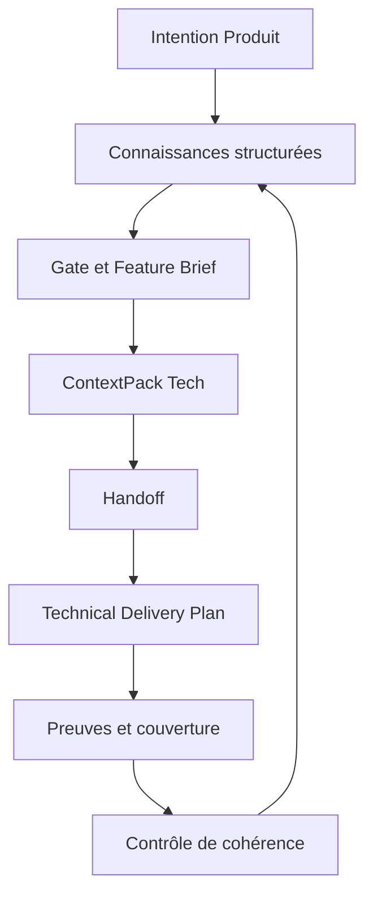

# AI Center — Périmètre du MVP

> Statut : scope validé pour démarrage — version 0.2  
> Date : 15 août 2026  
> Périmètre : première preuve utilisable du plan de contrôle contextuel, de l’intention jusqu’à la preuve.

## Résumé exécutif

Le MVP d’AI Center ne doit être ni un clone de ChatGPT, ni un gestionnaire de projets enrichi de fichiers Markdown, ni un lanceur mobile d’agents de code. Il doit prouver que le graphe opérationnel d’un projet permet d’organiser le travail de plusieurs agents, de compiler le bon contexte lors d’un passage de relais et de vérifier que le livrable obtenu respecte toujours l’intention initiale.

La première version doit permettre à un utilisateur de :

1. créer un projet à partir du template système **Software Product Delivery**, comportant deux nœuds racines, **Produit** et **Tech** ;
2. cadrer une évolution avec l’agent Produit et transformer la conversation en décisions, règles, exigences et questions ouvertes structurées ;
3. satisfaire un premier `Gate` produit et produire un `Deliverable` de type `FeatureBrief` ;
4. compiler automatiquement un `ContextPack` adapté à l’agent Tech ;
5. effectuer un passage de relais explicite, sans demander à l’utilisateur de reformuler le contexte ;
6. produire côté Tech un `TechnicalDeliveryPlan` relié aux exigences et accompagné d’une matrice de couverture ;
7. détecter proactivement une contradiction entre une règle Produit et une décision Tech ;
8. comprendre, accepter, rejeter ou résoudre cette contradiction ;
9. rattacher chaque livrable et chaque preuve aux connaissances qui les ont provoqués ;
10. retrouver le même état durable du projet depuis une interface web responsive, sur ordinateur comme sur téléphone.

Le graphe, le `ContextPack`, les contrats de livrables et les preuves sont présents dès le MVP. Sont différés : la personnalisation des templates, l’agent global inter-projets, la visualisation avancée du graphe, l’application Android native et le runtime macOS complet.

## Thèse produit testée

> Un utilisateur obtient davantage de valeur de plusieurs agents lorsque le système conserve l’intention du projet, compile pour chacun un contexte fiable, formalise leurs passages de relais et vérifie leurs résultats, plutôt que lorsqu’il lui laisse reconstruire lui-même ce workflow dans des chats, des prompts et des outils séparés.

Le MVP doit tester conjointement quatre hypothèses :

- **Structuration** — les décisions et exigences extraites d’une conversation sont plus réutilisables qu’un transcript ou un document isolé ;
- **Handoff** — le `ContextPack` permet de passer de Produit à Tech sans reformulation et sans chargement massif du projet ;
- **Contrôle** — un contrat de livrable et ses preuves permettent de savoir ce qui est réellement couvert, manquant ou incertain ;
- **Proactivité** — une contradiction détectée et expliquée sans demande explicite constitue un moment de valeur suffisamment fort pour différencier AI Center.

La mobilité et l’exécution distante ne sont plus des hypothèses fondatrices. Une PWA responsive suffit pour tester l’expérience sur plusieurs surfaces. Un premier adapter d’exécution réel sera ajouté après validation de la boucle contextuelle ; il démontrera l’interopérabilité, pas la différenciation.

## Promesse du MVP

> Je peux partir d’une intention produit, la transmettre à un agent technique sans reconstruire le contexte, obtenir un livrable vérifiable et être averti lorsque le résultat ou une nouvelle décision n’est plus cohérent avec ce qui avait été décidé.

## Les trois moments « waouh »

### 1. Moment contextuel

> « Je viens de prendre une décision côté Produit. AI Center a retrouvé seul une règle incompatible côté Tech, m’a expliqué le conflit et a relié les deux éléments. »

### 2. Moment de passage de relais

> « Je passe de Produit à Tech et l’agent technique comprend immédiatement l’objectif, les décisions, les contraintes et les critères d’acceptation, sans que je lui réexplique quoi que ce soit. »

### 3. Moment de contrôle

> « Le livrable paraît terminé, mais AI Center me montre qu’une exigence ne possède encore aucune preuve et qu’une décision récente invalide une partie du plan. »

Ces trois moments forment la preuve différenciante : cohérence, continuité et contrôle. L’exécution de code viendra ensuite prolonger la même chaîne.

## Scénario de référence

Le scénario suivant sert de test d’acceptation principal :

1. L’utilisateur crée le projet `Credits v2` avec le template `Software Product Delivery`.
2. Dans le nœud Produit, il dicte que « les crédits achetés n’expirent jamais ».
3. L’agent Produit challenge la règle, puis propose une entrée de type `business_rule`.
4. L’utilisateur la confirme ; elle est commitée dans le graphe du projet.
5. Dans le nœud Tech, une autre session établit qu’un job supprimera les crédits inutilisés après 90 jours.
6. L’agent Tech propose et commite une entrée de type `technical_rule`.
7. L’agent Produit produit un `FeatureBrief`. Le `ProductReadyGate` vérifie que l’objectif, la règle métier, les critères d’acceptation et les questions bloquantes sont traités.
8. AI Center compile un `ContextPack` et propose le handoff vers le nœud Tech.
9. L’agent Tech reçoit ce contexte avec sa provenance et produit un `TechnicalDeliveryPlan`.
10. Chaque section du plan est reliée aux exigences couvertes ; une matrice montre les exigences couvertes, partielles ou sans preuve.
11. Le commit de la règle technique déclenche le steward du projet.
12. Celui-ci sélectionne les entrées potentiellement liées, détecte le conflit sémantique et crée une proposition d’arête `contradicts`.
13. L’interface affiche un warning en reliant clairement les deux règles, leur origine et l’explication du conflit.
14. L’utilisateur modifie la règle technique, accepte temporairement la contradiction avec justification, ou rejette la détection comme faux positif.
15. Le `ContextPack`, le plan et la matrice de couverture sont invalidés ou revalidés en fonction de la résolution.
16. L’utilisateur retrouve le projet, les sessions, le handoff, la contradiction et les preuves après avoir fermé puis rouvert l’application.

## Tranche verticale fonctionnelle

## Limites structurelles du MVP

| Dimension | Choix MVP | Préparation du futur |
| --- | --- | --- |
| Utilisateurs | Un seul utilisateur | Identifiants d’auteur et d’acteur présents dans les événements |
| Surfaces | Web responsive / PWA | Applications natives et desktop possibles sans changer le domaine |
| Workspaces | Un workspace actif | Toutes les entités portent un `workspaceId` |
| Projets | Plusieurs projets créables, un projet actif par session | Identifiants globaux permettant des relations inter-projets futures |
| Template | Un template système `Produit + Tech` | Template, définitions de nœuds et profils d’agents modélisés comme données |
| Graphe | Un graphe scopé par projet | Endpoints d’arêtes compatibles avec des cibles externes au projet |
| Agents spécialisés | Produit et Tech | Association explicite `ContextNode → AgentProfile` |
| Agent global | Un steward par projet | Couche Center inter-projets différée |
| Proactivité | Contradictions et couverture manquante sur événements | Moteur extensible à d’autres insights |
| Handoff | Produit vers Tech | Handoffs arbitraires définis par les templates |
| Exécution | Livrable documentaire réel ; executor simulé derrière une interface | Premier adapter réel après validation du core |

## Modèle conceptuel minimal

### `Workspace`

Frontière durable de connaissance. Le MVP n’expose pas encore la gestion avancée de plusieurs workspaces, mais toutes les données appartiennent explicitement à un workspace.

### `Project`

Porte un graphe de connaissances, un template appliqué, un résumé condensé, des sessions et des exécutions.

### `ProjectTemplate`

Décrit les nœuds racines, leur hiérarchie initiale, les profils d’agents associés et les types de livrables attendus.

Le template MVP est fourni par le système et non modifiable. Il ne doit toutefois pas être codé uniquement dans l’interface : sa représentation doit permettre plus tard la création, la duplication et la personnalisation de templates.

### `ContextNode`

Représente un scope du graphe, par exemple Produit ou Tech. Un nœud peut avoir un parent et des enfants. Il porte :

- un titre et une description ;
- un résumé condensé ;
- un profil d’agent ;
- des règles de contexte ;
- des types d’entrées et de livrables privilégiés.

### `AgentProfile`

Décrit le rôle, les instructions, les outils accessibles, la politique de retrieval et les formats de sortie de l’agent lié au nœud.

Dans le MVP, les profils Produit et Tech sont fournis par le système. Leur personnalisation par l’utilisateur est hors périmètre, mais l’association ne doit pas être enfouie dans un `if product / if tech` irréversible.

### `KnowledgeEntry`

Atome de connaissance lisible, typé, versionné et rattaché à un nœud.

Types indispensables :

- `decision` ;
- `business_rule` ;
- `technical_rule` ;
- `requirement` ;
- `acceptance_criterion` ;
- `constraint` ;
- `open_question`.

Champs minimaux : identifiant, type, titre, énoncé, justification, statut, auteur, origine, nœud, version et dates.

### `Edge`

Relation typée et orientée entre deux objets du graphe.

Types indispensables :

- `references` ;
- `depends_on` ;
- `informs` ;
- `supersedes` ;
- `contradicts` ;
- `derived_from` ;
- `satisfies` ;
- `evidenced_by` ;
- `implemented_by`.

Les relations `tracked_by` et les connecteurs externes sont différés.

### `Session`

Porte la continuité conversationnelle, le scope courant, les messages, les propositions de mutation du graphe et les exécutions déclenchées.

### `ContextPack`

Projection versionnée et immutable du graphe, compilée pour une tâche, un agent et un instant donnés. Il contient l’objectif, les décisions applicables, les exigences, les contraintes, les dépendances, les questions ouvertes, les sources, les permissions et le contrat de résultat.

Un `ContextPack` n’est jamais la source de vérité : il référence les versions exactes des connaissances qui l’ont composé. Toute modification pertinente peut le rendre `stale` et déclencher une recompilation.

### `DeliverableContract`

Décrit ce qu’un agent doit produire et comment le résultat sera évalué. Il définit au minimum :

- les sections ou champs obligatoires ;
- les critères de complétude ;
- les types de preuves acceptés ;
- les relations attendues avec les exigences ;
- les conditions nécessitant une validation humaine.

Le MVP possède deux contrats système : `FeatureBrief` et `TechnicalDeliveryPlan`.

### `Deliverable`

Instance versionnée d’un contrat de livrable. Son contenu peut être affiché comme un document, mais reste composé de blocs structurés et reliés au graphe.

### `Gate`

Condition de passage entre deux étapes du modèle opératoire. Un gate évalue des règles déterministes et, lorsque nécessaire, une appréciation sémantique expliquée. Il peut être `pending`, `passed`, `passed_with_warning` ou `blocked`.

Le `ProductReadyGate` du MVP vérifie notamment la présence d’un objectif, de critères d’acceptation, des décisions structurantes et l’absence de question bloquante non assumée.

### `Evidence`

Élément attestant qu’une exigence ou une partie d’un livrable est couverte : citation de livrable, décision validée, résultat de test, fichier, commit ou validation humaine. Dans la première tranche, les preuves sont documentaires et traçables ; les preuves issues du code arrivent avec le premier adapter réel.

### `Task`

Travail explicite dérivé d’une décision, exigence ou résolution. Une tâche référence le `ContextPack` utilisé et le `DeliverableContract` attendu.

### `Execution`

Tentative confiée à un agent ou un runner. Elle expose l’exécutant, le `ContextPack`, le contrat attendu, son état et son résultat. Le core MVP utilise un agent Tech interne et un executor simulé ; un runner réel appartient à l’alpha utilisable.

### `Artifact`

Résultat produit ou référencé : livrable, rapport, document généré, fichier, test, commit, URL de preview ou pull request. Le core MVP exige les livrables structurés et leur matrice de couverture ; fichiers, commits, preview et pull request arrivent avec les adapters d’exécution.

### `Insight`

Observation proactive produite par le steward : contradiction, risque, information manquante ou absence de preuve. Dans le MVP, les sous-types `contradiction` et `coverage_gap` sont implémentés.

## Invariants du domaine

1. Chaque projet possède son propre graphe logique.
2. Chaque nœud appartient à un seul projet et peut former une hiérarchie.
3. Chaque nœud racine possède un profil d’agent explicite.
4. Une entrée de connaissance appartient à un nœud et possède un historique de versions.
5. Une arête référence des identifiants stables ; elle ne copie pas les objets reliés.
6. Une conversation ne devient pas automatiquement une vérité du graphe : l’agent propose des mutations structurées qui sont commitables et auditables.
7. L’agent d’un nœud reçoit le contexte détaillé de son scope, un résumé du projet et uniquement les voisins récupérés comme pertinents.
8. L’agent global raisonne sur la couche condensée et les entrées commitables, pas sur chaque token de toutes les conversations.
9. Toute action proactive possède une origine, une explication et un niveau de confiance.
10. Tout `ContextPack` référence les versions exactes des connaissances qui l’ont composé.
11. Tout livrable appartient à un contrat et expose son état de couverture.
12. Toute preuve est reliée à l’exigence ou à la décision qu’elle soutient.
13. Une connaissance modifiée peut invalider les `ContextPack`, gates, livrables et preuves qui en dépendent.

## Gestion des mutations du graphe

La conversation doit rester fluide. L’utilisateur ne remplit pas manuellement un formulaire après chaque décision.

Le flux retenu est :

1. l’agent identifie une information atomique ;
2. il produit une proposition structurée ;
3. les notes et questions faibles peuvent être enregistrées avec annulation possible ;
4. les décisions, règles et contraintes nécessitent une confirmation explicite ou une validation de lot en fin de séquence ;
5. le commit crée une nouvelle version et émet un événement ;
6. cet événement déclenche les vérifications proactives pertinentes.

L’interface doit rendre visibles les changements de connaissance sans transformer chaque échange en formulaire administratif.

## Agent spécialisé de nœud

L’agent Produit et l’agent Tech utilisent le même moteur conversationnel abstrait, mais diffèrent par :

- leurs instructions ;
- leurs outils ;
- les types d’entrées qu’ils privilégient ;
- leurs formats de livrables ;
- leur politique de retrieval ;
- leur scope par défaut.

Un agent spécialisé peut demander explicitement du contexte à un autre nœud. Il ne parcourt pas librement tout le graphe à chaque requête.

## Agent global de projet

L’agent global de projet n’est pas l’agent Center ultime. Il joue le rôle de steward du graphe courant.

Ses responsabilités MVP sont :

- maintenir ou proposer le résumé condensé du projet ;
- rechercher les entrées susceptibles d’être affectées par un commit ;
- vérifier la cohérence sémantique entre ces entrées ;
- produire une contradiction expliquée avec ses sources ;
- identifier les exigences sans preuve et les sections de livrable non couvertes ;
- marquer comme obsolètes les projections dépendant d’une connaissance modifiée ;
- revalider les contradictions ouvertes ou acceptées lorsqu’une entrée liée change.

Il est déclenché par événements, notamment :

- `KnowledgeEntryCommitted` ;
- `KnowledgeEntrySuperseded` ;
- `ContextPackCompiled` ;
- `DeliverableCommitted` ;
- `ContradictionAccepted` ;
- `ContradictionResolved`.

Il n’observe pas en permanence chaque mot de chaque session.

## Détection des contradictions

### Pipeline MVP

1. Une entrée est commitée ou modifiée.
2. Un premier filtre sélectionne des candidats par nœud, métadonnées, mots-clés, embeddings et relations existantes.
3. Un détecteur sémantique compare la nouvelle entrée aux candidats.
4. Il produit une explication, une confiance et une sévérité.
5. Une proposition d’arête `contradicts` et un `Insight` sont créés.
6. L’utilisateur traite le signal depuis l’interface.

### Confiance et sévérité

La confiance du modèle et l’impact métier sont deux dimensions distinctes.

Niveaux de sévérité MVP :

- `notice` — incohérence potentielle non bloquante ;
- `warning` — décision à examiner avant de poursuivre ;
- `blocking` — contradiction forte susceptible d’invalider le travail en cours.

Les signaux peu confiants restent dans une boîte d’insights. Seuls les warnings suffisamment confiants interrompent ou notifient l’utilisateur.

### Cycle de vie

- `candidate` — détectée par le système, pas encore qualifiée ;
- `open` — contradiction reconnue et non résolue ;
- `accepted` — incohérence assumée avec justification, auteur et date ;
- `resolved` — une entrée a été corrigée ou remplacée ;
- `dismissed` — faux positif ou relation non pertinente, conservé comme feedback.

Une contradiction acceptée reste visible. Si une entrée liée change, elle repasse en vérification et peut être rouverte.

## Expérience web responsive MVP

### Écrans indispensables

1. **Center** — projets actifs, décisions attendues, handoffs, livrables et insights prioritaires.
2. **Création de projet** — création depuis le template `Software Product Delivery`.
3. **Projet** — vue Produit / Tech, santé du projet, activité et prochaine action recommandée.
4. **Session de nœud** — conversation contextuelle, propositions de connaissances et validation fluide.
5. **Feature Brief** — livrable Produit structuré, sources, état du gate et éléments manquants.
6. **Handoff** — aperçu du `ContextPack`, provenance, limites et passage vers l’agent Tech.
7. **Technical Delivery Plan** — livrable Tech, exigences couvertes et preuves documentaires.
8. **Decision Inbox** — contradictions et trous de couverture priorisés.
9. **Détail d’un insight** — sources reliées, explication, impact et actions de résolution.
10. **Historique** — versions des connaissances, ContextPacks, livrables et décisions humaines.

### Saisie et dictée

Le texte est la saisie principale du premier incrément. La dictée du navigateur peut être ajoutée dès qu’elle n’interrompt pas la construction de la boucle centrale, mais elle n’est pas un critère de sortie du core MVP.

Ne font pas partie du MVP :

- la conversation vocale bidirectionnelle ;
- l’écoute permanente ;
- le déclenchement par mot-clé ;
- le widget système omniprésent.

### Représentation du graphe

Le MVP ne nécessite pas un canvas libre de type Neo4j ou FigJam.

Le graphe est rendu tangible par :

- la navigation Produit / Tech ;
- les cartes d’entrées structurées ;
- les relations affichées dans leurs détails ;
- une contradiction représentée comme un lien explicite entre deux entrées ;
- un compteur d’insights et un état de cohérence par nœud.

Une vue globale en lecture seule pourra être ajoutée après validation de la boucle principale.

## Exécution et adapters

L’abstraction d’exécution existe dès le core MVP, mais la première preuve ne dépend pas de l’installation d’un runtime macOS. Le premier executor est simulé avec des événements réalistes afin de valider le contrat, le suivi et la réintégration du résultat sans construire prématurément une infrastructure distante.

### Core MVP

- interface `ExecutorAdapter` indépendante du fournisseur ;
- exécution documentaire réelle par l’agent Tech ;
- executor de démonstration produisant plan, progression et résultat ;
- `ContextPack` transmis comme entrée immutable ;
- `DeliverableContract` transmis comme contrat de sortie ;
- réintégration du résultat, des preuves et des limites dans le graphe.

### Alpha utilisable

- intégration d’un seul agent de code cloud ou local derrière l’adapter ;
- enregistrement d’un dépôt autorisé ;
- événements structurés : plan, progression, demande, validation et résultat ;
- lancement des validations disponibles ;
- rapport final, références de fichiers ou commit ;
- relations `implemented_by` et `evidenced_by`.

### Capacités exclues

- contrôle arbitraire de tout macOS ;
- computer use généralisé ;
- plusieurs machines ou runners simultanés ;
- orchestration autonome de plusieurs agents de code ;
- éditeur de terminal complet dans AI Center ;
- garantie de preview ou création automatique de pull request ;
- détection automatique du drift entre code et connaissance.

## Autorisations et confiance

Le modèle anticipe au minimum :

- lecture dans le dépôt autorisé ;
- écriture dans le dépôt autorisé ;
- exécution de commandes prévues par l’agent de code ;
- accès réseau ;
- action hors du dépôt ;
- opération destructive ;
- publication distante, push ou création de PR.

Règle proposée pour le premier adapter réel : la confirmation du plan autorise les opérations réversibles dans le dépôt choisi pendant l’exécution courante. Les actions destructives, les sorties de périmètre, l’accès à des secrets et les publications distantes exigent une autorisation explicite.

Chaque action importante reste auditée et rattachée à une exécution.

## Périmètre fonctionnel priorisé

### P0 — indispensable à la preuve

- créer et retrouver un projet ;
- appliquer le template système `Software Product Delivery` ;
- ouvrir une session dans un nœud ;
- envoyer un message et reprendre une session persistante ;
- utiliser le profil d’agent correspondant au nœud ;
- créer, confirmer et versionner les entrées minimales ;
- créer et lire les relations du graphe ;
- produire un `FeatureBrief` conforme à son contrat ;
- évaluer le `ProductReadyGate` et expliquer les éléments bloquants ;
- compiler et inspecter un `ContextPack` pour l’agent Tech ;
- effectuer le handoff Produit → Tech sans reformulation ;
- produire un `TechnicalDeliveryPlan` conforme à son contrat ;
- relier le plan aux exigences et afficher leur couverture ;
- matérialiser les preuves documentaires et les limites ;
- déclencher le steward de projet sur commit ;
- détecter, expliquer et matérialiser une contradiction ;
- traiter son cycle de vie ;
- détecter une exigence sans preuve ;
- invalider ou revalider les projections affectées par une modification ;
- présenter toute la boucle dans une web app responsive utilisable sur téléphone et ordinateur.

### P1 — utile pour une bêta crédible

- session générale du Center puis rattachement à un projet ;
- dictée navigateur ;
- recherche sémantique dans les entrées du projet ;
- génération de vues documentaires Markdown ;
- suggestions de relations `references` ou `depends_on` ;
- écran condensé de santé du projet ;
- executor simulé avec événements structurés ;
- un premier adapter réel d’agent de code local ou cloud ;
- rattachement de fichiers, tests et commit comme preuves ;
- ouverture d’une preview ou d’une pull request existante ;
- fonctionnement dégradé propre lorsque l’executor est indisponible.

### P2 — après validation du MVP

- création et personnalisation de templates ;
- création libre de nœuds et sous-nœuds ;
- personnalisation des profils d’agents, outils et livrables ;
- agent Center inter-projets ;
- relations et contradictions automatiques entre projets ;
- couche de connaissances partagées au workspace ;
- promotion contrôlée d’une connaissance vers le workspace ;
- vue graphe globale en lecture seule puis éditable ;
- connecteurs Slack, Notion, Linear, Figma ou GitHub ;
- ingestion et mise à jour automatiques ;
- drift connaissance ↔ implémentation ;
- proactivité multi-signal ;
- automatisations planifiées ;
- application Android et application desktop natives ;
- runtime macOS packagé et appairage distant ;
- widget ambiant et conversation vocale complète ;
- collaboration, rôles, audit organisationnel et gouvernance.

## Ce qui est explicitement hors MVP

- expérience grand public non technique ;
- applications iOS, Android et desktop natives ;
- plusieurs utilisateurs dans le même workspace ;
- marketplace de templates ou d’agents ;
- nœuds et agents librement configurables par l’utilisateur ;
- graphe global monolithique chargé par tous les agents ;
- surveillance de tous les tokens par un watcher ;
- autonomie sans politique d’autorisation ;
- import exhaustif de l’écosystème d’entreprise ;
- édition détaillée du code depuis le téléphone.

## Séquencement de réalisation

### Slice 0 — Prototype UX vertical

Construire d’abord une interface cliquable avec le scénario `Credits v2` déjà peuplé. Elle doit rendre visibles le projet, les nœuds Produit et Tech, le `FeatureBrief`, le handoff, le `ContextPack`, le plan technique, la couverture et la contradiction.

Cette slice utilise des fixtures typées et aucune infrastructure lourde. Son objectif est de vérifier que l’expérience paraît être un système de pilotage — pas un chat accompagné d’une sidebar.

### Slice 1 — Walking skeleton persistant

- web app responsive et API ;
- modèle Project / ContextNode / KnowledgeEntry / Edge ;
- template `Software Product Delivery` ;
- création et versionnement des entrées ;
- événements de domaine ;
- persistance locale ou base de développement ;
- remplacement progressif des fixtures de la Slice 0.

### Slice 2 — Boucle Produit

- création et reprise de sessions ;
- profil d’agent Produit ;
- propositions de mutations du graphe ;
- validation fluide des entrées ;
- génération du `FeatureBrief` ;
- évaluation du `ProductReadyGate`.

### Slice 3 — Context Compiler et handoff Tech

- compilation du `ContextPack` avec provenance et versions ;
- écran de prévisualisation du handoff ;
- profil d’agent Tech ;
- génération du `TechnicalDeliveryPlan` ;
- relations entre exigences, sections et preuves ;
- matrice de couverture.

Cette slice produit le premier moment de valeur complet et doit être testée avant tout investissement dans un runner natif.

### Slice 4 — Steward et proactivité

- déclenchement sur commit ;
- sélection des candidats ;
- détection sémantique des contradictions ;
- détection des trous de couverture ;
- détail, sévérité et cycle de vie ;
- invalidation puis réévaluation des ContextPacks et livrables affectés.

### Slice 5 — Robustesse et évaluation

- jeu de cas contradictoires, compatibles et ambigus ;
- évaluation de l’extraction de connaissances et de la compilation de contexte ;
- faux positifs conservés comme feedback ;
- reprise de session et audit minimal ;
- onboarding ;
- instrumentation produit ;
- tests end-to-end du scénario de référence.

### Slice 6 — Premier adapter réel, après validation du core

- choix d’un agent local ou cloud ;
- interface `ExecutorAdapter` ;
- dépôt autorisé ;
- événements, autorisations et interruption ;
- rapport, fichiers et tests ;
- preuves `implemented_by` et `evidenced_by`.

## Critères de sortie fonctionnels

Le MVP est considéré complet lorsque :

1. un projet peut être créé avec ses nœuds Produit et Tech ;
2. chaque nœud utilise réellement un profil d’agent et un contexte différents ;
3. une session responsive peut produire des entrées atomiques confirmées ;
4. ces entrées persistent et sont retrouvées dans une autre session ;
5. un `FeatureBrief` est produit et contrôlé par le `ProductReadyGate` ;
6. un `ContextPack` Tech est compilé avec les versions et la provenance de ses sources ;
7. l’agent Tech produit un plan sans que l’utilisateur reformule le contexte Produit ;
8. le plan relie explicitement ses sections aux exigences et expose leur couverture ;
9. une contradiction entre Produit et Tech est détectée sans demande explicite ;
10. l’explication cite les deux entrées concernées ;
11. l’utilisateur peut accepter, résoudre ou rejeter le signal ;
12. une modification d’entrée invalide puis réévalue les projections dépendantes ;
13. au moins une absence de preuve est signalée et actionnable ;
14. l’application et la session peuvent être fermées puis reprises sans perte d’état.

## Critères de qualité

- aucune connaissance confirmée ne disparaît après une coupure réseau ;
- les mutations du graphe sont versionnées et auditables ;
- l’agent indique son scope et les sources contextuelles utilisées ;
- un `ContextPack` est reproductible à partir des versions qu’il référence ;
- un livrable distingue clairement contenu produit, sources, couverture et incertitudes ;
- une contradiction expose sa confiance, sa sévérité et son explication ;
- les alertes bloquantes restent rares et justifiables ;
- un executor ne peut pas recevoir silencieusement plus de contexte ou de permissions que prévu ;
- les événements d’exécution simulés ou réels sont structurés avant d’être résumés ;
- l’utilisateur peut toujours distinguer connaissance proposée, connaissance confirmée et résultat technique.

## Seuils d’évaluation IA provisoires

Ces seuils servent au dé-risquage interne, pas encore à une promesse commerciale :

- 100 % des contradictions structurelles déterministes du jeu de test détectées ;
- au moins 80 % de précision sur les contradictions sémantiques annotées ;
- au moins 70 % de rappel sur les contradictions sémantiques jugées importantes ;
- 100 % des éléments d’un `ContextPack` accompagnés de leur provenance ;
- 100 % des exigences affichées comme couvertes, partielles ou non couvertes ;
- aucune alerte `blocking` sans paire de sources et explication explicite ;
- moins d’un faux warning à haute priorité pour dix entrées confirmées lors des essais personnels.

Les seuils devront être révisés avec un corpus réel ; une précision faible détruirait plus rapidement la valeur qu’un rappel imparfait.

## Signaux de validation produit

- les entrées structurées sont réutilisées sans reformulation ;
- le changement de nœud réduit le besoin de réexpliquer le rôle ou le contexte ;
- le handoff Produit → Tech est jugé meilleur que copier-coller une spécification dans un nouveau chat ;
- l’utilisateur comprend ce qui compose le `ContextPack` sans devoir inspecter le graphe brut ;
- la matrice de couverture déclenche au moins une correction utile ;
- au moins une contradiction détectée est jugée réellement utile ;
- les faux positifs ne transforment pas l’inbox en bruit ;
- une session documentaire est considérée comme un résultat complet ;
- l’utilisateur préfère la boucle AI Center à la combinaison chat + document + nouveau chat spécialisé.

## Principaux risques et réponses de scope

| Risque | Réponse MVP |
| --- | --- |
| Construire un gestionnaire de chats banal | Graphe, agents scopés et contradiction obligatoires en P0 |
| Construire trop tôt une plateforme de graphe complète | Un projet, deux nœuds utiles et un vocabulaire minimal fermé |
| Fausse proactivité bruyante | Vérification sur commit, candidats filtrés, confiance, inbox et feedback |
| Contexte global trop gros | Résumés condensés et retrieval ciblé |
| Templates futurs impossibles à ajouter | Template et profils modélisés comme données dès la v0 |
| `ContextPack` opaque ou arbitraire | Provenance, versions, aperçu avant handoff et évaluation dédiée |
| Gates bureaucratiques | Contrôles automatiques, explications courtes et override justifié |
| Runtime trop ambitieux | Executor simulé dans le core, un adapter réel seulement après validation |
| Trop d’autorisations | Contrats et permissions attachés à la tâche, confirmation ciblée pour le risque |
| UX de graphe complexe | Relations rendues par cartes et détails, sans canvas complet |
| Perte de la vision inter-projets | Identifiants globaux et endpoints d’arêtes extensibles, sans moteur inter-projets en v0 |

## Décisions structurantes proposées

1. **Le graphe n’est pas post-MVP** : son atome utile est dans le P0.
2. **La contradiction est la première proactivité** : elle est la fonction différenciante à évaluer avant les autres automatisations.
3. **Le template est fixe mais data-driven** : personnalisation différée, architecture préservée.
4. **Les agents sont scopés par nœud** : même moteur possible, profils et contextes différents.
5. **Le steward agit sur les commits de connaissance** : pas de watcher sur chaque token.
6. **Le Markdown est une projection** : la source de vérité est structurée et requêtable.
7. **Le Context Compiler et les contrats de livrables sont dans le P0** : ils transforment le graphe en système de travail.
8. **Le premier handoff est Produit → Tech** : il constitue la boucle de validation prioritaire.
9. **La première surface est une PWA responsive** : la mobilité est conservée sans financer deux produits prématurément.
10. **Le runner n’est pas dans le core différenciant** : un executor simulé valide le protocole, puis un adapter réel ferme la boucle dans l’alpha.
11. **Les relations inter-projets sont préparées dans le modèle, pas automatisées dans la première version**.

## Arbitrages restant à confirmer

- Les mutations importantes sont-elles confirmées une par une ou validées en lot en fin de séquence ?
- Une contradiction `candidate` apparaît-elle immédiatement, ou seulement après un seuil de confiance ?
- Quel degré d’édition manuelle offrir dans les livrables structurés sans les transformer en traitement de texte ?
- Le `ProductReadyGate` peut-il être contourné avec justification, ou seulement passer avec warning ?
- Après validation du core, quel agent local ou cloud doit devenir le premier adapter réel ?
- Le premier adapter doit-il travailler sur un dépôt de démonstration contrôlé ou un side project réel ?

## Documents suivants recommandés

Le prochain travail ne doit pas être un document supplémentaire, mais la Slice 0 visible. Les documents d’architecture seront produits au fil des décisions imposées par ce prototype, dans l’ordre suivant :

1. `05-domain-model.md` — entités, agrégats, états, événements et invariants ;
2. `06-system-architecture.md` — web app, API/control plane, moteur de contexte, workers et protocoles ;
3. `07-security-and-trust-model.md` — autorisations, isolation et audit ;
4. `08-ux-flows.md` — parcours responsive, mutations du graphe, handoff, contradiction et exécution ;
5. `09-roadmap.md` — slices, dépendances et critères de passage.

Le modèle de domaine doit précéder l’architecture technique : ici, les distinctions entre nœud, entrée, arête, insight, agent et exécution déterminent directement les frontières du système.
